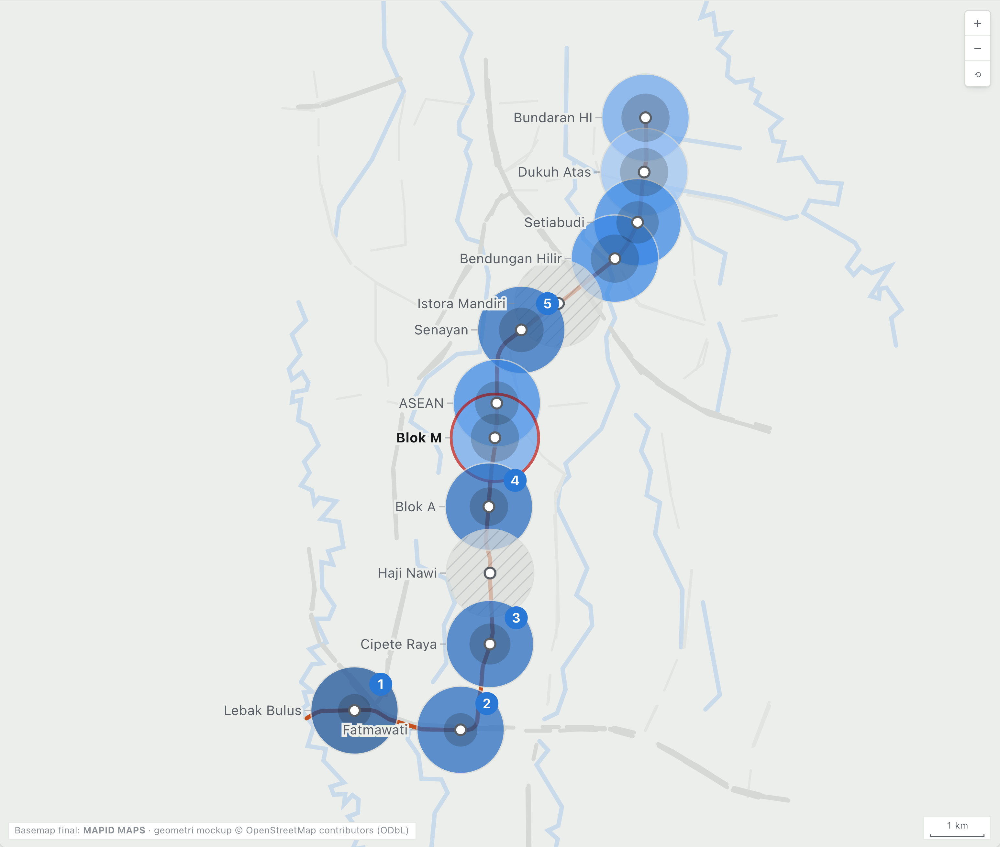
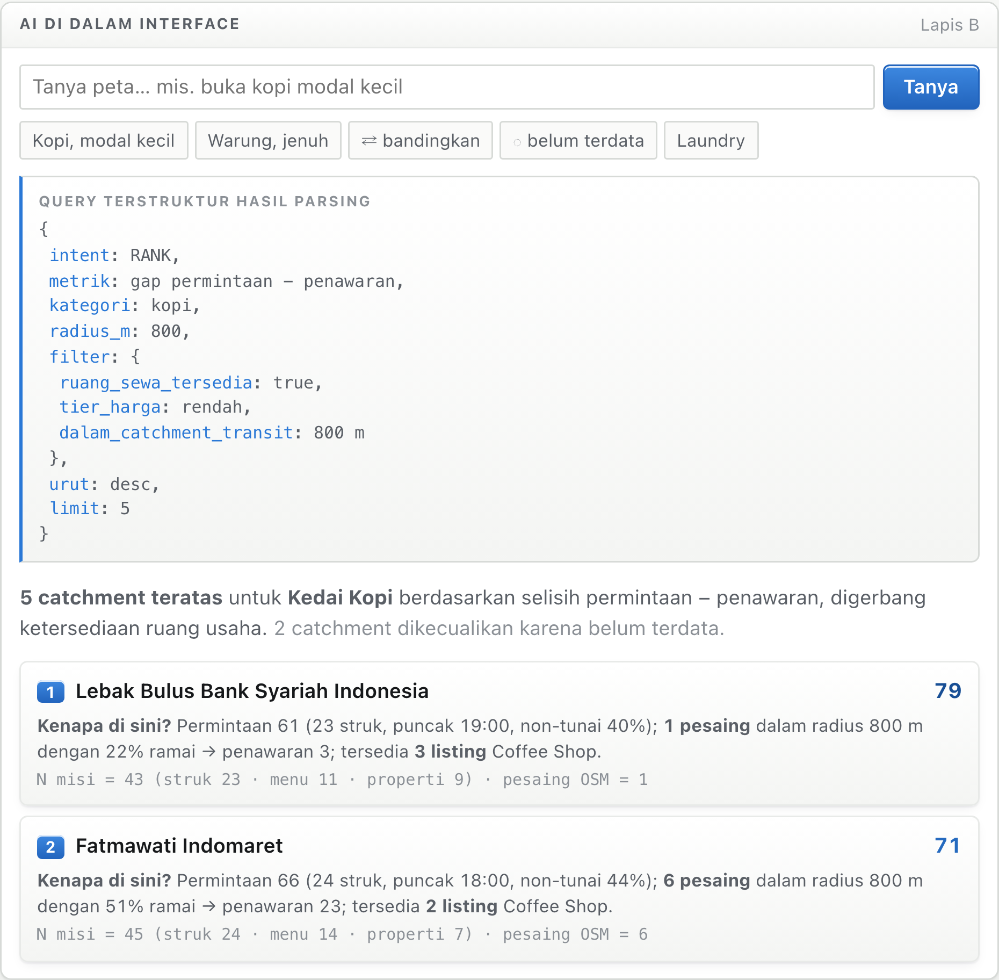
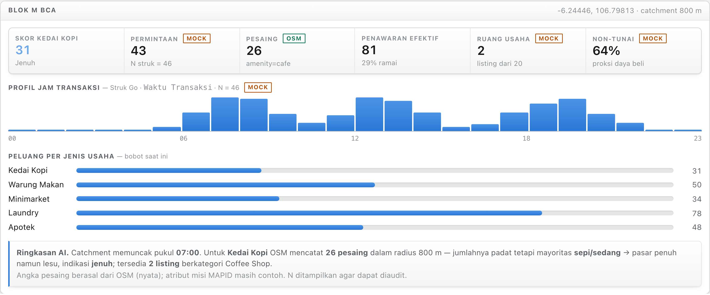
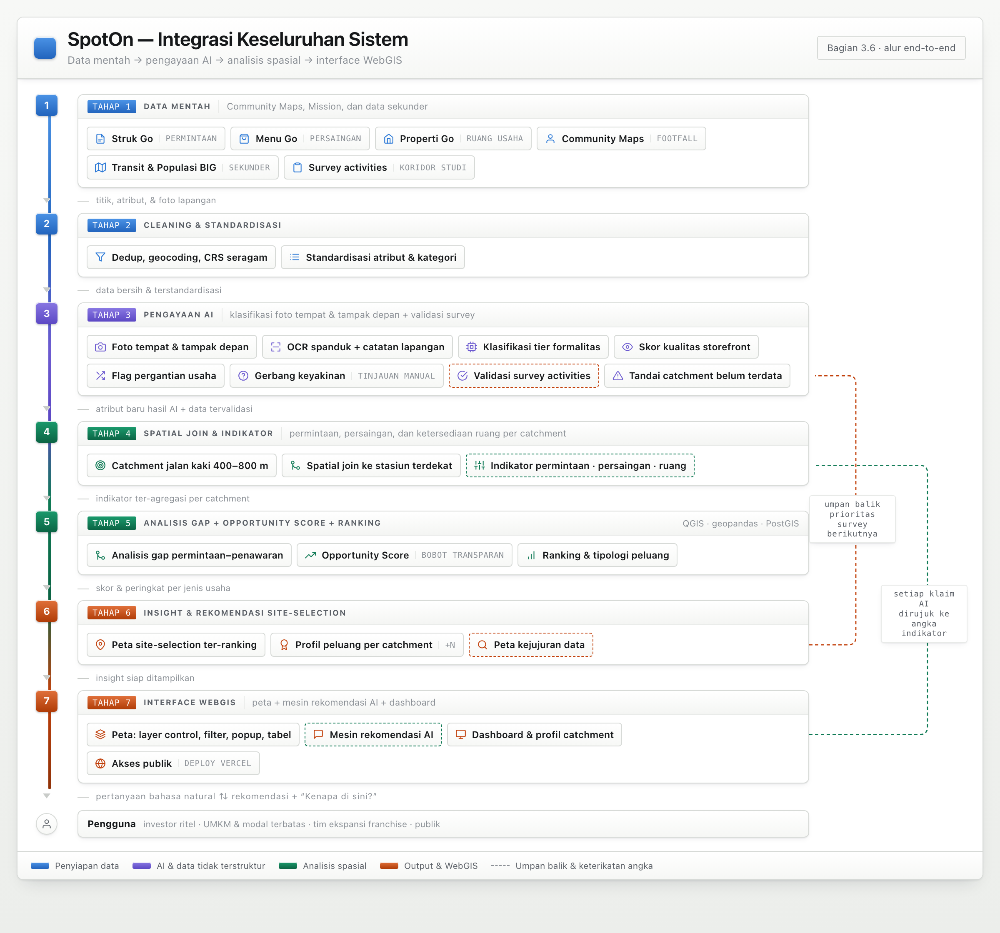

# WebGIS Idea Proposal: MAPID WebGIS Competition 2026
### *Maps That Think! Mass Transportation Edition*

> English translation of the proposal as submitted. Column names from the MAPID datasets
> (`Kategori Tempat`, `Waktu Transaksi`, `Kondisi Pembeli`, and the rest) are kept in the
> original Indonesian, because they are the literal field names in the data.

---

## Cover Page

**Project title:** ***SpotOn: An AI-Driven Site-Selection WebGIS for Retail & F&B around Jakarta's Transit Network***

**Team name:** Triple T

**Team members:**
| Name | Role | University | Programme | Semester |
|---|---|---|---|---|
| **Valent Nathanael** *(Lead)* | Project Lead / Data & AI Engineer | Universitas Bina Nusantara | Computer Science | 7 |
| **Farhan Aulianda** | Frontend / WebGIS Developer | Universitas Bina Nusantara | Computer Science | 6 |
| **Anthony Gilles Rudolfo** | GIS & Spatial Analyst / UI-UX | Universitas Bina Nusantara | Computer Science | 7 |

**Institution:** Universitas Bina Nusantara

**Team lead contact:** Valent Nathanael, valentnathana@gmail.com

> *Tagline:* Don't guess where to open. Ask the map.

---

## 1. Executive Summary

**The problem.** The areas around MRT, LRT, and TransJakarta stations are Jakarta's most
promising commercial magnets, because of the dense, daily, repeating flow of pedestrians
(*footfall*). Yet the decision about where to open a new retail or F&B business — a coffee
shop, a minimarket, a food stall, a restaurant — is almost always made on a guess, a
"feeling", or by copying a competitor. Investors, franchise chains, and above all small
businesses have no data that brings together the three things which decide whether a
location succeeds or fails: real demand (what residents buy, and when), competition
(density, price level, and how busy existing businesses actually are), and the availability
of commercial space that can genuinely be occupied. The consequence: the wrong location,
an early closure, capital burned.

**The WebGIS idea.** SpotOn is a *decision-support* WebGIS for site selection. The system
builds a walking catchment around each of Jakarta's transit stations, then computes an
Opportunity Score per business type through a demand–supply gap analysis. An interactive
map visualises the ranked locations per business category, while an AI recommendation
engine inside the interface gives a natural-language justification: *"Open a coffee shop in
the catchment of Station X because demand is high, competition is low, and rent is
affordable."*

**The data.** It uses MAPID's base data substantively, and every core indicator is built
from structured columns without depending on extracting values from photographs: Struk Go
as the demand signal (place category, transaction time, payment method), Menu Go as the
competition signal (type of eating place, average price per portion, how busy it is,
mobility), Properti Go as the commercial-space availability signal (property category,
rent/sale type), and Community Maps (activity) as a footfall proxy. All of it is enriched
with open secondary data (transit routes and nodes, population/BIG) and with *survey
activities* to thicken the data along the study corridor.

**The role of AI.** AI turns unstructured data (photographs of business premises,
photographs of property frontages) into new attributes that do not exist in the raw data:
formality tier and storefront quality. Then, inside the interface, it ranks candidate
locations and explains its reasoning to the user in human language.

**The impact.** A decision aid that lowers the risk of investing in the wrong location,
empowers small businesses to compete on the basis of data, and optimises the economic value
of the transit corridors.

---

## 2. Background to the Problem

**Context: transit areas are high-value commercial arenas, yet the location decision is
still a guess.**
Every Jakarta transit station channels thousands of pedestrians each day — the flow most
sought after by retail and F&B businesses. Naturally, coffee shops, minimarkets, fast-food
outlets, warung, and roaming vendors grow up around the stations. But the decision about
what business to open, and where, is almost never grounded in spatial data that brings
demand, competition, and space availability together. Getting the location wrong leads to a
high business failure rate, especially for operators with limited capital.

**Problem 1: demand is unmeasured.** How large is spending around a given station, and what
shape does it take? Which spending categories dominate: food, daily necessities,
pharmacies? This information is scattered across millions of receipts that have never been
aggregated spatially, so an investor has no way of knowing which catchment is genuinely
"thirsty" for a given business category.

**Problem 2: competition is unmapped.** Opening a coffee shop somewhere already saturated
with coffee shops is a recipe for failure. Yet there is no map showing the density of
similar businesses and their price level per area. Business operators are blind to how
saturated the market is and to the gaps still unworked.

**Problem 3: commercial-space availability is unmapped.** A market opportunity only means
something if there is space that can actually be occupied. The availability of shophouses,
retail units, and kiosks varies enormously between catchments: there are high-demand areas
that almost never have a vacant listing, and areas with a great deal of idle space. This
information is scattered across listings that are never linked back to the context of
demand or competition, so operators chase locations that are in practice closed to them.

**Problem 4: the three signals are never brought together.** This is the heart of it:
demand, competition, and space availability are analysed separately (when they are analysed
at all), whereas a good site-selection decision requires all three to be weighed together
in the same locational context — the station catchment.

**Connection to the theme.** This problem sits exactly at the intersection of the
competition's theme (mass transport) and a real-world issue the organisers explicitly give
as an example: location potential (*site selection*) and economic ecosystems around
transit. What makes it fit particularly well is that the MAPID datasets (Struk/Menu/Properti
Go) are economic and commercial in nature and naturally contain all three of the
demand–competition–space signals, making them well suited to answering the site-selection
question that other teams most often leave alone.

---

## 3. The Proposed Solution

### 3.1 Description of the solution and the problem it solves
**SpotOn** is a *decision-support WebGIS* for choosing a business location. For every
transit station in Jakarta, the system builds a walking catchment (400–800 m), gathers
every economic signal inside it, then computes an Opportunity Score per business type based
on a demand–supply *gap* analysis. The result is mapped interactively and explained by AI,
answering three questions a business operator has: *Where is demand for business X highest?
Where is competition still weak? Where is commercial space genuinely available — and where
do all three meet?*

### 3.2 Data sources & how they are visualised in the WebGIS
| Data group | Source | Role in the solution | Visualisation in the WebGIS |
|---|---|---|---|
| **Mission data: Struk Go** | MAPID | The DEMAND signal, from structured columns: `Kategori Tempat` (spending mix), `Waktu Transaksi` (hourly profile), `Metode Pembayaran` (a proxy for purchasing power and formality) | Choropleth of spending mix + hourly profile chart per catchment |
| **Mission data: Menu Go** | MAPID | The COMPETITION signal, from structured columns: `Jenis Tempat Makan`, average price per portion (numeric), `Kondisi Pembeli`, mobility | F&B point layer coloured by price tier + competitor density heatmap |
| **Mission data: Properti Go** | MAPID | The COMMERCIAL-SPACE AVAILABILITY signal: `Kategori Properti` and type (`Sewa`/`Jual`). Prices on banner photographs are an optional enrichment only, not a core indicator | Commercial listing points + an availability indicator per catchment |
| **Community Maps (activity)** | MAPID | A proxy for FOOTFALL and user participation activity | Activity cluster/heatmap |
| **Transit routes & nodes** | Open secondary data | The basis for catchments and intermodal pedestrian flow | Route lines + station nodes |
| **Population (BIG)** | Open secondary data | Context on population density and the base of potential demand | Optional context layer |
| **Survey activities** | Curated teams (MAPID APPS) | Thickening one study corridor (menu boards and storefronts can be photographed from the pavement) + validating field conditions | Photographs & condition scores in the popup |

The primary basemap uses MAPID MAPS (mandatory). Every layer comes with layer control,
filters, attribute popups, a location table, and an attribute table.

*Figure 1. Prototype of the SpotOn interface along the MRT North–South corridor. The 800 m
catchment circles are drawn at true scale (Web Mercator projection, 0.1% distance error).
Station coordinates and names, line geometry, the road network, and the count of competitor
POIs per catchment are taken as-is from OpenStreetMap; catchments with no mission data are
hatched, not interpolated.*

### 3.3 Spatial analysis and/or prediction method
1. **Building the catchments**: a walking buffer/isochrone around each station.
2. **Spatial join**: attaching every Struk/Menu/Properti Go and activity point to the
   nearest station catchment.
3. **DEMAND indicators**: from Struk Go's structured columns — transaction count, the
   composition of spending categories (F&B, minimarket, pharmacy, and so on), the hourly
   transaction profile (morning/afternoon/evening, which determines the *format* of the
   business, not just its category), and the cashless ratio as a proxy for purchasing power
   and the formality of the area. *The rupiah values on receipt photographs are not used as
   a core indicator.*
4. **COMPETITION indicators**: from Menu Go's structured columns — business density per
   `Jenis Tempat Makan`, the median average price per portion (the price ceiling the local
   market will bear), the ratio of *roaming* to fixed vendors, and the distribution of
   `Kondisi Pembeli`. Crossing density × how busy competitors are is the primary
   opportunity detector: dense + mostly *quiet* = a saturated market; sparse + mostly *busy*
   = a real demand gap.
5. **SPACE AVAILABILITY indicators**: from Properti Go — the number of commercial listings
   per `Kategori Properti`, the rent:sale ratio (the liquidity of the commercial space
   market), and how well the listing category matches the intended business type. Treated
   as a feasibility gate (no space means no opportunity), not merely as a cost variable.
6. **Demand–supply *gap* analysis**: for each business category, compare the demand signal
   against supply density → detecting hotspots (demand and supply both high) versus
   gaps/opportunities (demand high, supply low).
7. **Opportunity Score**: a normalised opportunity score per business type per catchment:
   `Gap(business) = Demand(category) − Supply(category)`, where supply is weighted by how
   busy the competitors are (*busy* competitors = strong supply; *quiet* = weak supply),
   then gated by commercial-space availability. The weights are transparent, explainable,
   and adjustable by the user directly in the interface.
8. **Ranking & typology**: ordering catchments per business type and grouping them into
   opportunity profiles (*underserved / competitive / saturated / busy-but-space-limited*).
9. **Data-reliability discipline**: (a) analysis is aggregated at corridor level while point
   density is still low, then brought down to station level once the data is complete and
   survey results are in; (b) the number of points (N) is displayed alongside every score;
   (c) catchments with no data are shown as "belum terdata" (not yet surveyed), not
   interpolated into a plausible-looking value. This honesty about the data is part of the
   output, not a footnote.

Spatial analysis prefers open-source tools (QGIS / geopandas / PostGIS), as the organisers
recommend.

### 3.4 The role of AI in the system (input → process → output)
AI is present in two layers, both producing *spatial output*:

**Layer A: data enrichment (offline, during the pipeline):**
- *Input:* photographs of business premises (Menu Go `Foto Tempat`), frontage photographs
  (Properti Go), plus photographs and field notes from *survey activities*.
- *Process:* visual classification produces attributes not available in the raw data:
  formality tier (permanent / semi-permanent / cart), storefront quality and visibility
  (signage, frontage, building condition), and an indication of how ready the commercial
  space is. Optionally: OCR on Properti Go banner photographs to flag phrases such as *"take
  over usaha"* / *"over kontrak"* as a signal that a business is changing hands.
- *Output:* new attributes that can be mapped per point (formality tier, storefront quality
  score, business-turnover flag), feeding directly into the competition and space
  availability indicators.
- *Validation:* a confidence level is shown per tag; low-confidence classifications are
  routed to a *"needs manual review"* status rather than stated as fact. They are
  cross-checked against the dataset's own structured attributes (`Jenis Tempat Makan`,
  `Mobilitas`, `Kategori Properti`) and against *survey activities* samples.
- *Important note:* without this classification, those attributes do not exist at all — the
  AI's role is to produce data, not merely to narrate figures a formula has already
  computed.

**Layer B: the AI recommendation engine inside the WebGIS interface (interactive,
mandatory):**
- *Input:* user actions (clicking a station/catchment, choosing the business type they want
  to open, setting weight priorities, or typing a question such as *"where is the best place
  to open a small-capital coffee stall?"*).
- *Process:* the AI reads the demand–competition–space indicators and the Opportunity Score
  of the selected area, ranks candidate locations, then composes a natural-language
  justification that refers to the indicator figures.
- *On-screen output:* "Location Recommendations" (a ranked list of catchments for the chosen
  business type + the map highlighted), "Why here?" (the justification: high demand / quiet
  competitors / space available, with the supporting figures and the N behind them), and
  "Catchment Opportunity Profile" (a narrative summary of each area).
- *Validation:* every claim the AI makes refers back to an indicator figure shown in the
  panel (transparent and auditable by the user), so the recommendation never becomes a
  "black box".

*Figure 2. The AI panel inside the interface. A natural-language question is translated into
a structured query which is shown verbatim (intent, metric, category, radius, filter), then
executed by PostGIS. Every recommendation carries a "Why here?" justification along with the
N data points behind it, so it can be audited and cannot be invented by the model.*

### 3.5 Primary output in the form of insight or recommendation
- **A ranked *site-selection* map per business type** (coffee shop, minimarket, F&B, warung,
  pharmacy, and so on).
- Identification of hotspots versus demand–supply gaps per business category.
- Narrative AI recommendations: "where to open business X and why", ready for a stakeholder
  to read.
- **An opportunity profile for each catchment**: demand, competition, and space availability
  summarised on a single card, complete with the number of data points (N) underlying it.
- Highlighted opportunities for small-capital businesses (e.g. locations with high demand,
  quiet competitors, and small commercial units available).
- **A data-honesty map**: catchments not yet surveyed are shown as they are — *"belum
  terdata"* — which doubles as the priority list for the next round of *survey activities*.

*Figure 3. The detail panel for a single catchment. Every indicator is labelled with its
source (`OSM` = real, `MOCK` = sample), accompanied by the N points behind it, the hourly
transaction profile, the opportunity ranking across business types, and an AI summary
consistent with its own figures.*

### 3.6 Overall system integration (end-to-end)
`Raw data — Community Maps, Mission, and secondary data` → `Cleaning & standardisation` →
`AI enrichment — classifying premises and frontage photographs + survey validation` →
`Spatial join & indicators — demand, competition, and space availability per catchment` →
`Gap analysis + Opportunity Score + ranking` → `Site-selection insight & recommendations` →
`WebGIS interface — map + AI recommendation engine + dashboard`. This flow is identical to
the organisers' 8-stage framework (Section B.3), which makes the correspondence easy to
assess.

*Figure 4. SpotOn's end-to-end flow, from raw data to the WebGIS interface, coloured by
phase. Two dashed lines mark relationships that are more than mere sequence: catchments
marked "belum terdata" return priority to the next round of survey activities, and every
claim the AI recommendation engine makes is bound to the Stage 4 indicator figures.*

---

## 4. The WebGIS's Potential and Benefits

**Target market / users:**
- **Retail / F&B investors**: choosing expansion locations on the basis of data about
  demand, competition, and space availability, rather than guesswork.
- **Small businesses and operators with limited capital**: finding valuable locations whose
  space is genuinely affordable, and competing on the basis of data.
- **Prospective household entrepreneurs (the public layer)**: a resident planning to open a
  warung, a laundry, or a small stall near home can ask the map directly — *"what business
  makes sense around here?"* — and receive an answer with its reasoning, with no GIS skills
  required. This public layer doubles as a participation channel: photographs of menu boards
  and storefronts submitted by users enrich the competition layer.
- **Franchise expansion teams**: screening and ranking candidate locations across transit
  corridors quickly.
- **Property owners and agents**: understanding the commercial potential of their listings
  and targeting the right tenants.

**Scalability:** the catchment + Opportunity Score framework is *city-agnostic* and can be
replicated to Bandung, Surabaya, or any other city simply by swapping in the local transit
data and MAPID datasets. Adding stations, corridors, or new business categories does not
change the architecture.

**Competitive landscape & advantages:**
- **The main differentiator:** using MAPID's economic datasets (Struk/Menu/Properti Go)
  *substantively* to answer a concrete, commercial site-selection question, rather than
  merely displaying routes and points as most ordinary accessibility solutions do.
- **Bringing together the three decision signals** (demand–competition–space availability)
  that are normally scattered, precisely in the context of the transit corridors.
- **Every core indicator comes from structured columns**, so the analysis does not depend on
  extracting numbers from photographs: the solution still stands while data density is low,
  and strengthens as the full data and survey results arrive.
- **AI that is genuinely spatial and interactive**: a recommendation engine that ranks
  locations and explains its reasoning, satisfying the AI-in-interface requirement naturally
  rather than as a bolted-on feature.
- **Insight and recommendations, not raw data**: in line with the organisers' primary
  judging criterion.
- **The small-business empowerment angle** gives it strong social value and narrative.

---

## 5. Technical Feasibility
> *Note: the final stack will be adjusted to the team's strengths (see Appendix 1). What
> follows is the reference plan.*

**Reference architecture:**
- **Frontend / map:** MapLibre GL JS + MAPID MAPS as the primary basemap; UI in React. The
  mandatory interactions (zoom, click, filter, layer control, attribute table) are fully
  supported.
- **Backend / API:** a lightweight service (Node/Express or FastAPI) serving layers,
  indicators, and the AI recommendation endpoint.
- **Spatial database:** PostgreSQL + PostGIS / MongoDB (spatial join, buffer, aggregation).
  MAPID data is accessed through the documented API given to the 50 curated teams.
- **Spatial analysis:** QGIS / geopandas / PostGIS (open-source, as recommended).

- **AI:** a lightweight image classification model (e.g. CLIP *zero-shot* / MobileNet) for
  photographs of premises and frontages; an LLM via API with tool-use / function-calling
  against a limited set of spatial operations in PostGIS, for ranking and narrative
  justification. The LLM chooses the operation and fills in the arguments; the figures are
  always computed by the database and never invented by the model. AI-produced scores and
  attributes are cached so the interface stays fast.
- **Deployment:** public on Vercel (frontend) + API hosting; responsive on desktop and
  mobile, with a reasonable load time.

**Key technical requirements & risk mitigation:**
- *Completeness of mission data per catchment* → aggregate at corridor level while the data
  is still sparse, display N alongside every score, and use the *"belum terdata"* status for
  empty catchments. Survey activities are directed at thickening one study corridor: menu
  boards can be photographed from the pavement without a transaction or any special
  permission, which makes them the cheapest data to multiply.
- *The Struk Go sample as a demand proxy* → receipt points record the merchant's location,
  not where the buyer lives. They are therefore presented as a relative indicator between
  catchments, not an absolute estimate of demand; and reinforced with BIG population context
  and footfall activity.
- *Time-of-day bias in `Kondisi Pembeli`* → busyness is recorded at the moment of the
  surveyor's visit; comparisons are made across equivalent hour ranges and cross-checked
  against the Struk Go hourly profile.
- *The computational cost of real-time AI* → pre-computed scores + cache; interactive AI is
  used only for narration and light ranking.
- *The quality of the AI's visual classification* → a confidence level is shown per tag;
  low-confidence results enter a *"needs manual review"* queue rather than being stated as
  fact. Cross-validated against the dataset's structured attributes (`Jenis Tempat Makan`,
  `Mobilitas`, `Kategori Properti`) + survey samples.

---

## 6. Conclusion
**SpotOn** turns MAPID's community and mission data into a spatial decision tool that
answers the most concrete business question around Jakarta's transit network: *what business
should be opened, where, and why?* The solution meets every mandatory component: an
interactive map on top of MAPID MAPS, AI inside the interface producing ranked spatial
recommendations, and output in the form of insight and recommendations rather than raw data.
Its advantage is clear: it brings together the three decision signals (demand from Struk Go,
competition from Menu Go, space availability from Properti Go) that until now have been
scattered — all of them from structured columns, without hanging the analysis on extracting
numbers from photographs — links them to the economic flow of the transit network, and
presents them through a recommendation engine that investors and small businesses alike can
understand. Our team deserves to go through because the idea is real, the data is sound, the
method can be explained, and the WebGIS can be implemented and is immediately useful to
business operators.

---

## Appendix 1: Team Assessment
**Team name:** Triple T, Universitas Bina Nusantara

**All team members:** Valent Nathanael (Lead), Farhan Aulianda, Anthony Gilles Rudolfo

1. **Frontend frameworks/libraries we know:** React; Svelte / SvelteKit; Next.js; Vue;
   Tailwind CSS; TypeScript; JavaScript; HTML/CSS; Three.js; Mapbox GL JS; MapLibre GL JS.

2. **Backend languages & frameworks we have used:** Node.js; FastAPI (Python); Go; Rust; C#;
   PHP; GraphQL; Kafka; Docker; Terraform; CI/CD; AWS; GCP; Cloudflare; DigitalOcean; Linux.

3. **Geospatial databases we have used:** PostgreSQL; MongoDB; Supabase; Redis; ClickHouse.
   PostGIS has not been used before and will be adopted on top of PostgreSQL. Supporting
   analysis: geopandas; QGIS.

4. **AI stack we know:** PyTorch; TensorFlow; Keras; scikit-learn; LangChain; LiteLLM;
   Strands Agents.

---
*Format note: convert to A4 PDF, minimum 11pt font, maximum 10 pages. File name:
`[TeamName_ProjectTitle]`. Also include the 2 signed consent documents.*
