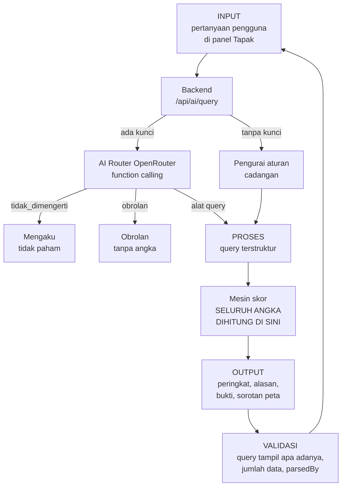
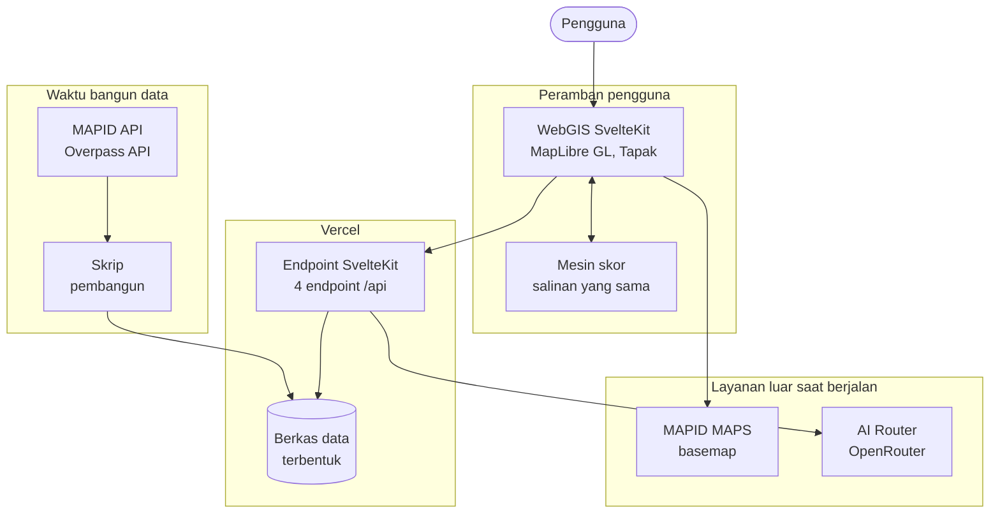

# PRODUCT REQUIREMENT DOCUMENT (PRD)

**MAPID WebGIS Competition #2 - 2026**
*Maps That Think! - Mass Transportation Edition*
WebGIS - Spatial Intelligence untuk Transportasi Massal

> Disusun mengikuti *Template PRD MAPID WebGIS Competition 2026*. Urutan dan judul bagian
> mengikuti template. Seluruh angka di dokumen ini dibaca dari data yang ada di repositori
> (`src/lib/data/hexes.json` beserta blok `meta` yang ditulis oleh skrip pembangun data),
> bukan diketik tangan. Membangun ulang datanya membuat setiap angka di sini ikut berubah.

---

## Halaman Judul

| | |
|---|---|
| **Nama Tim** | Triple T |
| **Judul Proyek** | SpotOn, WebGIS *site-selection* untuk usaha ritel dan F&B di catchment transit Jakarta |
| **Institusi** | Universitas Bina Nusantara |
| **Ketua Tim** | Valent Nathanael |
| **Kontak** | *[isi email dan nomor WhatsApp ketua tim sebelum dikumpulkan]* |

**Anggota Tim**

| No. | Nama Lengkap | Peran dalam Tim |
|---|---|---|
| 1 | Valent Nathanael | Project Leader, pengembangan WebGIS dan mesin skor |
| 2 | Farhan Aulianda | *[konfirmasi peran]* |
| 3 | Anthony Gilles Rudolfo | *[konfirmasi peran]* |

*Catatan: peran anggota 2 dan 3 perlu dikonfirmasi tim sebelum dikumpulkan. Dokumen ini
tidak mengarang isian yang hanya tim yang tahu.*

*Nama berkas saat dikumpulkan: `TripleT_SpotOn.pdf`, A4, font minimal 11 pt.*

---

## 1. Ringkasan Eksekutif

**Ide WebGIS.** SpotOn adalah WebGIS *site-selection* yang menjawab satu pertanyaan yang
sangat sering ditanyakan dan hampir tidak pernah terjawab dengan data: usaha apa yang masuk
akal dibuka di sekitar sini, dan kenapa. Untuk setiap petak dalam jangkauan jalan kaki dari
simpul transit Jakarta, SpotOn membaca tiga sinyal yang selama ini terpisah, yaitu permintaan,
persaingan, dan ketersediaan ruang usaha, lalu menghitung **Skor Peluang** per jenis usaha dan
menjelaskan alasannya dalam bahasa manusia.

**Masalah utama.** Calon pemilik warung, kedai, atau laundry memilih lokasi dengan cara
berjalan di satu ruas jalan, melihat ramai, lalu menandatangani kontrak. Tiga hal yang
sebenarnya menentukan usaha itu bertahan atau tidak semuanya bisa diketahui, tetapi tersebar
di tempat berbeda dan tidak pernah dibaca bersama pada resolusi jalan kaki.

**Dataset.** Katalog Data Premium MAPID sebagai sumber utama, yaitu **24.630 titik pesaing**
dari 55 dataset untuk 13 kategori usaha, dan **3.547 listing properti komersial**. Ditambah
misi lapangan MAPID Apps, yaitu **1.027 catatan** dari Struk Go, Menu Go, Properti Go, dan
catatan komunitas, **709** di antaranya jatuh dalam jangkauan jalan kaki sebuah petak. Ditambah data pendukung terbuka dari OpenStreetMap melalui Overpass API,
yaitu **1.105 simpul transit** empat moda dan **5.711 POI pesaing**, sesuai ketentuan data
pendukung pada aturan panitia.

**Rencana Survey Activities.** Misi lapangan sudah masuk ke produk dan turun di **191 dari
562 petak**, jadi rencana tim adalah melanjutkannya, bukan memulainya. Survei diarahkan oleh
antrian prioritas yang dihasilkan produk sendiri, yaitu **371 petak yang belum memuat satu
catatan pun**, lalu 100 petak yang belum tercakup katalog pesaing, lalu 178 petak yang harga
ruangnya belum terbaca. Survei mengisi justru lubang yang produk ini menolak menambalnya
dengan angka karangan.

**Analisis spasial.** *Spatial join* titik pesaing dan listing properti ke kisi heksagon H3
resolusi 8 pada lima radius jalan kaki, penghitungan indeks akses transit berbobot moda, lalu
*scoring* dan *indexing* peluang per kategori usaha. Catatan lapangan digabungkan dengan
aturan yang berbeda, yaitu satu catatan tepat satu petak asal, dan **tidak pernah masuk ke
skor**.

**Peran AI.** Model bahasa lewat OpenRouter dengan *function calling* menerjemahkan pertanyaan
bebas berbahasa Indonesia menjadi **query terstruktur**. Model hanya memilih operasi dan
mengisi argumen. **Seluruh angka dihitung mesin skor dari data**, dan query terstrukturnya
ditampilkan apa adanya supaya jawabannya bisa diperiksa.

**Hasil utama.** Daftar pendek petak berperingkat per jenis usaha, lengkap dengan alasan satu
kalimat, rincian skor tahap demi tahap, bukti lapangan yang disebut satu per satu di samping
skor, jumlah data di belakang setiap klaim, dan penandaan jujur untuk wilayah yang memang
belum terdata.

---

## 2. Tujuan Produk

### Problem Statement

**1. Kondisi atau masalah saat ini.** Pemilihan lokasi usaha kecil di Jakarta dilakukan dengan
pengamatan sesaat. Tiga penentu kelayakan lokasi masing-masing terpisah, yaitu berapa banyak
orang yang benar benar lewat, berapa banyak pesaing sejenis yang sudah ada, dan apakah ada
ruang usaha yang bisa ditempati dengan harga yang sanggup dipikul. Tidak ada alat publik yang
membaca ketiganya bersama pada resolusi jalan kaki.

**2. Pihak yang terdampak.** Pemilik dan calon pemilik usaha mikro dan kecil, terutama yang
baru pertama kali membuka usaha dan modalnya terbatas. Ikut terdampak pemilik atau agen
properti yang unitnya menganggur di lokasi yang sebenarnya kurang terlayani, serta tim
ekspansi ritel dan waralaba.

**3. Dampak dari masalah.** Modal yang tidak besar habis di lokasi yang sudah jenuh, atau di
lokasi yang ramai tetapi ramai untuk jenis usaha yang lain. Kerugiannya ditanggung sendiri,
sering kali beserta sisa kontrak sewa yang tetap harus dibayar.

**4. Kenapa penting diselesaikan dengan WebGIS.** Pertanyaan ini tidak punya bentuk selain
bentuk spasial. Permintaan, persaingan, dan ketersediaan ruang semuanya adalah sifat sebuah
area yang bisa dijalani kaki, dan ketiganya berubah dalam jarak beberapa ratus meter. Tabel
tidak bisa menyatakan bahwa satu petak dilayani MRT sekaligus dua koridor TransJakarta
sementara petak di sebelahnya tidak dilayani apa pun. Jaringan transit massal justru yang
membuat soal ini bisa dikerjakan, karena transit menaruh aliran orang yang berulang dan bisa
diperkirakan pada sekumpulan tempat yang diketahui.

### Tujuan

**1. Tujuan utama produk.** Memberi calon pemilik usaha daftar pendek lokasi berperingkat per
jenis usaha di sekitar jaringan transit Jakarta, beserta alasan yang bisa mereka ulangi
sendiri.

**2. Hasil yang ingin diberikan kepada pengguna.** Bukan peta yang harus ditafsirkan, melainkan
jawaban yang bisa ditindaklanjuti. Setiap angka bisa dibuka sampai ke titik sumbernya di dalam
antarmuka, dan setiap klaim membawa jumlah data di belakangnya.

**3. Dampak yang diharapkan.** Keputusan lokasi yang diambil dengan bukti, bukan tebakan.
Modal usaha kecil yang lebih jarang habis di lokasi yang sebetulnya sudah bisa dibaca jenuh
sejak awal, dan ruang komersial menganggur yang lebih cepat bertemu penyewa yang cocok.

### Value Proposition

**1. Pengguna utama dan masalahnya.** Pemilik usaha mikro dan kecil yang tidak melek GIS,
belum pernah membaca peta koroplet, dan sedang menimbang satu keputusan besar dengan modal
terbatas.

**2. Cara produk membantu.** Produk bertanya lebih dulu, bukan menunggu ditanya. Tapak, tokoh
pemandu di dalam antarmuka, menyapa, menanyakan usaha apa yang sedang dipikirkan, dan
menawarkan jawaban yang tinggal disentuh. Pengaturan lanjutan disembunyikan, tetapi angka
lengkapnya selalu satu ketukan jauhnya.

**3. Manfaat bagi pengguna.** Daftar pendek yang bisa langsung didatangi, alasan yang bisa
disampaikan ke pasangan atau pemberi pinjaman, dan gambaran harga ruang di sekitarnya.

**4. Keunggulan solusi dan nilai tambah.**

| Unsur | Nilai tambah yang spesifik |
|---|---|
| WebGIS | Unit analisisnya heksagon H3 resolusi 8, bukan catchment per halte. Halte TransJakarta berjarak 400 sampai 500 m sedangkan jangkauan jalan kaki 800 m, sehingga catchment per halte akan bertumpuk dan menghitung pembeli yang sama berulang kali. Pada kisi, tiap petak dihitung sekali dan akses transit menjadi sifat petak, sehingga lokasi yang dilayani MRT sekaligus TransJakarta memang unggul |
| Survey Activities | Catatan lapangan disebut satu per satu dengan nama dan tanggal di samping skor, jadi angka yang dihitung mesin bisa dibantah bukti yang dilihat orang. Survei berikutnya pun tidak diarahkan ke tempat yang paling mudah, melainkan ke antrian prioritas yang dihasilkan produk sendiri |
| Analisis spasial | Ketersediaan ruang usaha diperlakukan sebagai **gerbang**, bukan bonus. Peluang yang tidak bisa ditempati bukan peluang |
| AI | Model hanya memilih operasi dan mengisi argumen. Tidak satu angka pun berasal dari model, dan query terstrukturnya ditampilkan apa adanya untuk diperiksa |
| Kejujuran data | Petak yang belum disurvei ditulis belum terdata, tidak pernah dibaca sebagai nol pesaing. Kalau data kosong dibaca nol, wilayah yang paling sedikit diperiksa justru akan dinobatkan sebagai peluang terbaik |

---

## 3. Ruang Lingkup Produk

### In-Scope

- **Fitur utama.** Peta interaktif satu layar penuh, penyaring 13 kategori usaha, bobot
  permintaan dan persaingan yang bisa digeser, radius jalan kaki 400 sampai 800 m, gerbang
  ketersediaan ruang, pemilih sumber pesaing, panel rincian petak, panel bukti lapangan,
  tabel atribut petak dan unit properti, serta panel percakapan AI.
- **Dataset.** Katalog Data Premium MAPID untuk pesaing dan properti komersial, misi lapangan
  MAPID Apps untuk bukti lapangan, ditambah data pendukung terbuka OpenStreetMap untuk simpul
  transit, geometri jalur, dan POI pesaing.
- **Analisis spasial.** Pembangunan kisi H3 resolusi 8, *spatial join* titik ke petak pada
  lima radius, penetapan satu petak asal bagi tiap catatan lapangan, indeks akses transit
  berbobot moda, dan *scoring* peluang per kategori.
- **Visualisasi WebGIS.** Koroplet Skor Peluang, titik pesaing, titik unit properti, penanda
  tempat catatan lapangan difile, jalur dan simpul empat moda transit, legenda skor yang
  selalu tampak, dan penandaan petak belum terdata.
- **Dashboard dan insight.** Rincian skor tahap demi tahap, batang peluang lintas kategori,
  rincian moda transit yang dijangkau petak, ringkasan pesaing, ringkasan harga ruang, dan
  daftar catatan lapangan yang disebut satu per satu.
- **Peran AI.** Pemahaman pertanyaan bahasa Indonesia menjadi query terstruktur lewat
  *function calling*, penyusunan ringkasan, perbandingan antarpetak, penandaan kejenuhan, dan
  laporan cakupan data.
- **Output utama untuk pengguna.** Daftar pendek petak berperingkat per jenis usaha, dengan
  alasan, bukti angka, dan jumlah data di belakangnya.
- **Dwibahasa dan aksesibilitas.** Seluruh teks tersedia dalam Bahasa Indonesia dan Inggris,
  tema terang dan gelap, serta penghormatan penuh pada `prefers-reduced-motion`,
  `prefers-reduced-transparency`, dan `prefers-contrast`.

### Out-of-Scope

- **Peramalan omzet atau jumlah pengunjung.** Mesin melaporkan selisih peluang, bukan proyeksi
  pendapatan. Angka rupiah yang bukan harga penawaran teramati akan menjadi angka karangan.
- **Pasar properti.** SpotOn menampilkan apa yang dipasarkan di sekitar petak, tetapi tidak
  memperantarai, menghubungi penjual, atau menyimpan stok unit.
- **Harga sewa.** Katalog tidak menerbitkan satu pun listing sewa untuk Jakarta, sehingga
  produk tidak akan menampilkan harga sewa. Lihat bagian 4.
- **Wilayah di luar Jabodetabek**, dan wilayah yang tidak terjangkau 800 m dari simpul transit.
- **Akun pengguna, penyimpanan daftar pendek, dan fitur kolaborasi.**
- **Aplikasi selain WebGIS.** Tidak ada aplikasi seluler *native*.
- **Klasifikasi visual dari foto.** Fotonya sekarang ada, yaitu foto struk dan foto tempat
  pada misi lapangan, jadi penghalangnya bukan lagi data melainkan waktu. Dijadwalkan pada
  tahap akhir dan tidak dijanjikan lebih awal dari itu.
- **Angka belanja dari struk.** Kolom totalnya ada di formulir dan seluruhnya kosong, jadi
  tidak ada nilai rupiah yang bisa dibaca dari struk. Yang ada hanya fotonya.

---

## 4. User Persona

### Persona 1 - Calon pemilik usaha mikro, pengguna utama

- **Nama:** Bu Rina
- **Jabatan:** Calon pemilik warung makan, saat ini karyawan yang akan resign
- **Usia:** 38 tahun
- **Latar Belakang:** Tinggal di Jakarta Timur. Modal berasal dari pesangon dan tabungan,
  jumlahnya terbatas dan tidak bisa diulang. Memakai ponsel Android kelas menengah dengan
  kuota data. Belum pernah memakai perangkat GIS dan belum pernah membaca peta koroplet.
- **Goals:** Menemukan dua atau tiga lokasi yang masuk akal untuk didatangi langsung minggu
  ini, dan tahu kira kira ruang usaha di sana dijual berapa per meter persegi.
- **Pain Points:** Semua ruas jalan terlihat ramai pada jam tertentu. Tidak tahu berapa
  pesaing sejenis yang sudah ada di radius jalan kaki. Takut menandatangani kontrak di lokasi
  yang ternyata sudah jenuh.
- **Needs:** Jawaban dalam bahasa sehari hari, alasan yang bisa diulang ke suami dan ke
  pemberi pinjaman, serta kejelasan bahwa angkanya berasal dari hitungan, bukan tebakan.
- **User Stories:**
  - Sebagai calon pemilik warung, saya ingin bertanya "di dekat stasiun mana warung makan
    masih kurang" dan mendapat daftar pendek, supaya saya tidak perlu belajar peta.
  - Sebagai pengguna yang tidak melek GIS, saya ingin melihat alasan satu kalimat pada setiap
    lokasi yang direkomendasikan, supaya saya bisa menilai sendiri masuk akal atau tidak.
  - Sebagai pemilik modal terbatas, saya ingin tahu berapa banyak pesaing yang dihitung dan
    dari survei mana angkanya, supaya saya tahu seberapa tebal dasarnya.

### Persona 2 - Tim ekspansi ritel

- **Nama:** Bapak Adi
- **Jabatan:** Manajer Ekspansi, jaringan minimarket dan kedai kopi
- **Usia:** 41 tahun
- **Latar Belakang:** Bertanggung jawab atas rencana pembukaan gerai tahunan. Terbiasa membaca
  data, memakai laptop, dan sudah punya kriteria internal. Membutuhkan pembanding eksternal
  yang metodenya bisa diaudit.
- **Goals:** Menyaring koridor transit menjadi daftar petak prioritas per kategori, dan
  menandai wilayah yang sudah jenuh supaya tidak dimasukkan ke rencana.
- **Pain Points:** Data pesaing dari sumber berbeda tidak bisa dibandingkan langsung. Survei
  lapangan mahal, jadi harus diarahkan ke tempat yang paling perlu.
- **Needs:** Perbandingan antarpetak, penandaan kejenuhan, kemampuan mengganti sumber pesaing
  dan melihat pengaruhnya, serta laporan cakupan data yang jujur.
- **User Stories:**
  - Sebagai manajer ekspansi, saya ingin membandingkan dua catchment secara langsung, supaya
    saya bisa memilih di antara keduanya.
  - Sebagai perencana survei, saya ingin melihat petak mana yang belum terdata, supaya anggaran
    survei diarahkan ke sana.
  - Sebagai pembaca data, saya ingin mengganti sumber pesaing antara OSM dan MAPID dan melihat
    skornya berubah, supaya saya tahu seberapa besar sumber memengaruhi kesimpulan.

---

## 5. Dataset Dasar

Sumber utama adalah data MAPID. Data OpenStreetMap dipakai sebagai data pendukung yang resmi,
terbuka, relevan, dan disebutkan sumbernya, sesuai ketentuan data pendukung pada aturan
panitia.

| Dataset | Sumber | Fungsi dalam Produk |
|---|---|---|
| Katalog pesaing Data Premium, **24.630 titik**, 55 dataset, 13 kategori usaha | MAPID Data Premium melalui `geoserver.mapid.io` | Sisi persaingan pada Skor Peluang, dan sisi permintaan setelah kategori yang ditanyakan dikurangkan. Tercakup pada **462 dari 562 petak**, yaitu lima kota administrasi DKI Jakarta |
| Katalog properti komersial, **3.547 listing** | MAPID Data Premium melalui `geoserver.mapid.io` | Gerbang ketersediaan ruang usaha dan faktor biaya ruang. Digabungkan pada lima radius jalan kaki. **462 petak** tercakup, **284 petak** punya harga yang terbaca |
| Basemap MAPID MAPS | MAPID Map Service, `v2.basemap.mapid.io` | Basemap utama WebGIS, sesuai ketentuan wajib panitia. Gaya terang dan gelap dipilih mengikuti tema pembaca |
| Misi lapangan **Struk Go 195, Menu Go 99, Properti Go 141** | MAPID Apps, endpoint publik `server.mapid.io/web/survei/public/{misi}` | Bukti lapangan di samping skor, yaitu struk yang tercatat, keramaian yang dilihat surveyor, dan ruang yang ditawarkan. Yang jatuh di dalam petak: struk 98, tempat makan 61, properti 54 |
| Catatan komunitas, **592 catatan** | MAPID Apps, endpoint publik `mobile/v2/communities/activities/public` | Aktivitas dan catatan lapangan di sekitar petak, dibaca bersama ketiga misi di atas. **496** di antaranya jatuh di dalam petak |
| Simpul transit empat moda, **1.105 simpul**, yaitu MRT 20, KRL 76, LRT 33, TransJakarta 976, beserta geometri jalur | OpenStreetMap melalui Overpass API, lisensi ODbL | Pembentukan kisi, penghitungan indeks akses transit per petak, dan lapisan jaringan pada peta |
| POI pesaing, **5.711 titik** untuk 9 kategori yang bisa ditandai OSM | OpenStreetMap melalui Overpass API, lisensi ODbL | Sumber pesaing kedua yang bisa dipilih pengguna, sekaligus penutup lubang pada 100 petak yang belum tercakup katalog MAPID |
| Batas administrasi kota, `admin_level=5` | OpenStreetMap | Penentu cakupan per kota, dipakai untuk memutuskan petak mana yang boleh diberi skor |

**Catatan penting mengenai misi lapangan.** Ketiga misi tidak diterbitkan sebagai lapisan,
sehingga mencarinya di katalog premium maupun di indeks lapisan tidak akan pernah berhasil.
MAPID Apps menyajikannya dari endpoint publiknya sendiri, tanpa kunci, tanpa project, dan
tanpa id lapisan. `scripts/fetch-missions.mjs` membaca keempatnya dan menulis
`src/lib/data/mission.json`, yaitu **1.027 catatan** di dalam jangkauan kisi.

Dari jumlah itu, **709 catatan** jatuh dalam radius jalan kaki sebuah petak dan memperoleh
petak asal, tersebar di **191 dari 562 petak**. Sisanya berada di luar jangkauan jalan kaki
petak mana pun, jadi tidak dihitung ke petak mana pun. Angka yang dipakai di antarmuka selalu
angka yang kedua, karena itulah yang benar benar berdiri di sebuah catchment.

Data ini **jenisnya berbeda** dari seluruh data lain di produk, dan perbedaan itu menentukan
cara memakainya. OpenStreetMap dan katalog MAPID mengklaim kelengkapan untuk kota yang mereka
liput, dan itulah yang membuat angka nol dari keduanya menjadi temuan. Misi lapangan adalah
survei yang dijalani orang. **191 dari 562 petak** memuat catatan, dan 371 sisanya bukan
jalan yang sepi, melainkan jalan yang belum didatangi siapa pun. Maka tiga aturan berlaku,
dan `scripts/selftest-field.mjs` menguji ketiganya:

1. **Tidak ada isi `field` yang masuk ke perhitungan skor.** Kalau dilipat ke dalam
   aritmetika, "belum ada yang ke sini" akan menjadi persis sama dengan "di sini tidak
   terjadi apa apa".
2. **Petak yang belum didatangi tidak punya kunci `field` sama sekali**, bukan sederet nol.
   Dua ukuran yang bisa ditanyakan membaca null di situ, sehingga petak itu gugur dari
   peringkat dan tidak memenuhi seluruh isi pertanyaan "di mana yang paling sedikit".
3. **Hitungan sah dari satu catatan, sedangkan pangsa dan median butuh tiga.** Hitungan satu
   itu persis benar. "Di sini semua bayar pakai QRIS" dari satu struk adalah klaim tentang
   satu sore.

Setiap label yang dibaca pengguna berbunyi **tercatat**, bukan menyebut hal itu sendiri, jadi
"struk tercatat" dan bukan "belanja". Panel yang menampilkannya menyatakan terang terangan
bahwa ini bukan sensus.

Kosakata tertutup pada formulir ditally ulang setiap kali skrip berjalan, sehingga angka
seperti di bawah ini terbaca dari data dan bukan diingat siapa pun:

| Kolom | Tally |
|---|---|
| Metode pembayaran, 195 struk | QRIS 131, Tunai 24, E-wallet 21, Debit 12, Kartu Kredit 7 |
| Keramaian yang dilihat surveyor, 99 catatan Menu Go | sedang 53, sepi 27, ramai 19 |
| Jenis tempat, 99 catatan Menu Go | Warung atau tenda 27, Kafe 27, Restoran 20, Fast food 17, Kaki lima atau gerobak 8 |
| Penawaran, 141 catatan Properti Go | **jual 86, sewa 55** |
| Jenis properti, 141 catatan Properti Go | Ruko 90, Rumah 24, Tanah 15, Kos 5, Retail 3, Kantor 2, Laundry 1, Gudang 1 |

Satu catatan diberi **tepat satu petak asal**, yaitu pusat petak terdekat dalam radius jalan
kaki, dan aturannya tinggal di `scripts/lib/home-cell.mjs`. Ini kebalikan dari gabungan
properti, yang menghitung satu listing ke setiap petak yang menjangkaunya. Menghitung ganda
benar untuk kerapatan dan fatal untuk daftar, karena catatan lapangan disebut satu per satu
dengan namanya.

Struk Go membawa sebelas kolom di luar ketentuan §A.4, semuanya berakhiran `(Lama)` dan
seluruhnya null atau 0,0, termasuk kolom total pengeluaran. Jadi **tidak ada angka belanja di
dalam data**, yang ada hanya foto struknya. Ini persis asumsi yang dipakai sejak proposal.

**Catatan penting mengenai data properti.** Katalog menerbitkan **harga penawaran jual**, dan
tidak satu pun listing sewa untuk DKI Jakarta. Ini bukan asumsi, melainkan hasil pengukuran:
`scripts/fetch-property.mjs` menghitung ulang kolom jual atau sewa pada seluruh dataset
properti provinsi setiap kali dijalankan, dan hasilnya 3.547 baris bernilai `JUAL`. Produk
mengikuti hasil pengukuran itu, jadi kolomnya bernama harga dan bukan sewa, dan antarmuka
menyebutnya harga jual yang diminta. Median di seluruh kisi pada radius 800 m adalah
**Rp 45.000.000 per m²**. Satu petak baru diberi harga bila ada minimal **3 unit berharga**
dalam jangkauan, karena dua unit terlalu tipis untuk dibaca mediannya.

Satu satunya sewa di dalam produk datang dari misi lapangan, bukan dari katalog. Formulir
Properti Go menanyakan hal yang berbeda, dan **55 dari 141 catatannya menjawab disewa**, **20**
di antaranya jatuh di dalam petak. Yang tidak pernah ditanyakan formulir itu adalah harganya,
dan antarmuka menyatakan hal itu juga.

---

## 6. Rencana Survey Activities

Misi lapangan MAPID Apps sudah masuk ke produk, yaitu 1.027 catatan terbaca dan 709 di
antaranya turun di 191 petak.
Bagian ini adalah rencana tim untuk **melanjutkannya**, bukan rencana untuk memulai dari nol.
Yang sudah ada memperlihatkan bentuk keluarannya, dan yang direncanakan adalah menutup 371
petak yang belum didatangi siapa pun.

### Lokasi

- **Wilayah pelaksanaan.** Koridor transit di Jabodetabek, dibatasi pada petak yang sudah ada
  di kisi produk, yaitu area dalam radius 800 m dari simpul MRT, KRL, LRT, atau TransJakarta.
- **Batas dan cakupan.** Survei diarahkan oleh antrian prioritas yang dihasilkan produk
  sendiri, dengan tiga kelompok sasaran yang berurutan:
  1. **371 petak yang belum memuat satu catatan lapangan pun.** Inilah lubang terbesar, dan
     satu satunya yang produk tidak akan pernah bisa tutup sendiri, karena tidak ada cara
     membedakan jalan yang sepi dari jalan yang belum didatangi kecuali dengan mendatanginya.
  2. **100 petak yang belum tercakup katalog pesaing MAPID**, yaitu Depok 20 petak, Bekasi
     21, Tangerang 17, Tangerang Selatan 15, Kabupaten Bekasi 5, Kabupaten Tangerang 2, dan
     20 petak yang berada di luar batas administrasi mana pun.
  3. **178 petak yang tercakup properti tetapi harga ruangnya belum terbaca**, yaitu selisih
     462 petak tercakup dengan 284 petak yang sudah punya median harga.
- Urutan pengerjaan di dalam tiap kelompok memakai peringkat permintaan, sehingga petak yang
  tradenya paling tebal disurvei lebih dahulu.

### Objek

- **Objek yang disurvei.** Mengikuti tiga formulir yang sudah berjalan. Struk Go untuk bukti
  transaksi di gerai, Menu Go untuk tempat makan beserta keramaian yang terlihat, dan
  Properti Go untuk ruang usaha yang ditawarkan. Ditambah catatan komunitas untuk hal yang
  tidak masuk ke tiga formulir itu.
- **Informasi yang dikumpulkan tiap objek.** Persis kolom yang sudah terbaca pembacanya,
  sehingga hasil survei tim masuk lewat jalur yang sama dengan data yang sudah ada.

### Output

Atribut yang dihasilkan survei, mengikuti daftar pada template dan mengikuti kolom formulir
yang sebenarnya:

| Atribut template | Kolom yang sudah terbaca |
|---|---|
| Nama objek atau tempat | `Nama Tempat` pada Struk Go, `Nama Tempat Makan` pada Menu Go |
| Kategori objek | `Kategori Tempat`, `Jenis Tempat`, `Kategori Properti` |
| Tanggal dan waktu survei | `Tanggal` pada ketiga formulir |
| Alamat | alamat pada Properti Go |
| Foto dokumentasi | `Foto Struk`, foto tempat, dan foto properti |
| Kondisi objek | keramaian yang dilihat surveyor, yaitu sepi, sedang, atau ramai |
| Catatan survei | catatan komunitas yang difile di samping ketiga misi |
| Latitude dan longitude | koordinat setiap catatan, dipakai untuk menentukan petak asalnya |
| Informasi tambahan | metode pembayaran, jenis properti, dan status jual atau sewa |

Dua nama kolom sudah terbukti tidak sama dengan yang tertulis di ketentuan, yaitu
`Nama Tempat Makan` tanpa garis miring dan `Tanggal` pada Properti Go yang berawalan satu
spasi. Keduanya sudah tertangani daftar alias di dalam pembaca, dan setiap kolom yang tidak
terpetakan dilaporkan apa adanya pada setiap kali skrip berjalan.

### Ketentuan Survey yang dipatuhi

- Data harus sesuai kondisi lapangan.
- Koordinat harus sesuai lokasi objek.
- Foto harus jelas dan tidak buram.
- Foto tidak menampilkan wajah seseorang secara jelas maupun plat nomor kendaraan.
- Data tidak berasal dari sumber manipulasi seperti Google Street View atau internet.
- Data hasil survei divalidasi sebelum dipakai, dengan pemeriksaan silang terhadap hitungan
  katalog pada petak yang sama.
- Berkas contoh yang dibagikan panitia **sengaja tidak dimasukkan ke repositori**, karena
  ketentuan §B.7 melarang menyebarkan data mentah MAPID ke pihak luar dan repositori ini bisa
  saja menjadi publik.

### Pemanfaatan Hasil Survey

| Pemanfaatan | Wujudnya di dalam SpotOn |
|---|---|
| Melengkapi dataset dasar | 371 petak yang hari ini tidak memuat catatan apa pun mulai memuat bukti lapangan, sehingga panelnya berhenti kosong |
| Memvalidasi kondisi lapangan | Keramaian yang dilihat surveyor dibandingkan dengan permintaan yang dihitung mesin skor dari kerapatan usaha, dan selisihnya dilaporkan apa adanya |
| Menambahkan titik data pada peta | Setiap catatan tampil di peta pada petak asalnya, dan panel lapangan menyebutnya satu per satu dengan nama, tanggal, dan jaraknya |
| Menjadi input analisis spasial | Dua ukuran sudah bisa ditanyakan langsung, yaitu jumlah struk tercatat dan jumlah ruang yang ditawarkan sewa. Keduanya memeringkat, dan keduanya tetap **tidak masuk ke skor** |
| Menjadi dasar insight atau rekomendasi AI | Pertanyaan tentang apa yang dicatat surveyor dijawab dari catatan yang sama, dan foto struk beserta foto tempat membuka klasifikasi visual sebagai pengembangan berikutnya |

## 7. Metode Pengolahan Data, AI, dan Analisis Spasial

### Data Processing

**Cleaning.** Simpul transit dari Overpass dinormalkan lalu dideduplikasi menjadi 1.105 simpul
dari empat moda. Nama halte dan stasiun dirapikan agar satu simpul tidak terhitung dua kali
karena beda penulisan. Kategori usaha dari katalog MAPID dipetakan ke 13 kategori produk, dan
pemetaan itu ditulis eksplisit pada `domain/categories.ts` supaya bisa diperiksa. Kolom
formulir misi lapangan dicocokkan lewat daftar alias, karena nama kolom yang sebenarnya tidak
selalu sama dengan yang tertulis di ketentuan, dan setiap kolom yang tidak terpetakan
dilaporkan pada setiap kali skrip berjalan alih alih hilang diam diam.

**Validasi.** Aturan pokoknya adalah **kosong bukan nol**, dan aturan itu berlaku dua kali di
sini karena ada dua jenis kekosongan yang berbeda. Katalog mengklaim kelengkapan untuk kota
yang diliputnya, sehingga nol dari katalog adalah temuan, sedangkan misi lapangan adalah
survei yang dijalani orang, sehingga tidak adanya catatan bukan temuan apa apa. Petak yang kotanya tidak pernah
disurvei sumber aktif mengembalikan skor `null` dan tipologi belum terdata, tidak pernah
diberi angka. Kategori yang tidak punya tag OSM, yaitu warteg, mie, seafood, dan restoran
asing, dibaca sebagai belum terdata pada sumber OSM, bukan nol pesaing. Bila satu kategori
dalam satu pertanyaan gabungan belum terdata, seluruh gabungannya dinyatakan belum terdata,
karena penjumlahan yang diam diam melewati bagian yang hilang adalah kebohongan yang sama pada
tingkat himpunan. Enam berkas uji mandiri dijalankan lewat `npm run selftest` untuk komposisi
skor, hitungan POI, gabungan properti, penguraian pertanyaan, unit properti, dan misi lapangan
terhadap kedua berkas yang dihasilkannya.

**Integrasi catatan lapangan.** Setiap catatan diberi tepat satu petak asal pada waktu
pembangunan data, yaitu pusat petak terdekat dalam radius jalan kaki, dan petak itu tidak
dihitung ulang di peramban. Gabungan properti melakukan yang sebaliknya, yaitu menghitung satu
listing ke setiap petak yang menjangkaunya, dan itu benar untuk kerapatan tetapi fatal untuk
daftar: satu struk yang sama akan muncul di lima kartu sekaligus dan hitungan di atas tiap
daftar akan salah tanpa ada yang bisa menangkapnya. Aturannya tinggal di satu berkas,
`scripts/lib/home-cell.mjs`, supaya gabungan yang menghitung dan pembangun yang mendaftar tidak
mungkin berselisih.

**Integrasi dua survei pesaing.** Dua survei tidak pernah dijumlahkan. Katalog MAPID mencatat 2.351 kedai kopi dan OSM
mencatat 1.170, dan 1.170 itu sebagian besar kedai yang sama tanpa id bersama untuk
dicocokkan. Menjumlahkannya akan melaporkan satu ruas dengan delapan kedai kopi sebagai empat
belas. Kerapatan keduanya juga jauh berbeda, misalnya OSM mencatat 65 kedai minuman untuk
seluruh Jakarta sedangkan MAPID mencatat 858, sehingga jumlah pesaing tidak boleh
dibandingkan lintas sumber. Sumber `both` membaca tiap petak dari survei yang benar benar
menjangkaunya, dan bila keduanya menjangkau, dari yang menemukan lebih banyak. Hasilnya adalah
lantai, bukan tebakan, yaitu sekurang kurangnya sebanyak ini, karena ada yang menghitungnya.

### Spatial Analysis

**1. Metode analisis spasial yang digunakan.** Pembangunan kisi heksagon H3 resolusi 8,
*spatial join* titik ke petak pada lima radius jalan kaki, pembangunan indeks akses transit
berbobot moda dengan peredaman akar, *ranking* harga ruang di seluruh kisi, serta *scoring*
dan *indexing* peluang per kategori usaha.

**2. Data yang digunakan.** Simpul transit dan POI pesaing OSM, titik pesaing katalog MAPID,
listing properti komersial MAPID, catatan misi lapangan MAPID Apps, dan batas administrasi
kota. Catatan lapangan ikut dalam analisis sebagai **bukti dan sebagai dua ukuran yang bisa
ditanyakan**, yaitu jumlah struk tercatat dan jumlah ruang yang ditawarkan sewa, tetapi tidak
pernah masuk ke rumus skor.

**3. Tujuan analisis.** Mengukur selisih antara permintaan dan persaingan pada satu petak untuk
satu jenis usaha, lalu menyesuaikannya dengan akses transit, ketersediaan ruang, dan harga
ruang.

**4. Output yang dihasilkan.** Skor Peluang 0 sampai 1 per petak per kategori, tipologi petak,
peringkat, serta rincian tahap demi tahap yang bisa dibaca pengguna.

**Rumus Skor Peluang**

```
Gap   = (wd · permintaan − ws · persaingan) / (wd + ws)
Skor  = clamp01(Gap + 0.5) × gerbang_ruang × akses_transit × biaya_ruang
```

| Suku | Dihitung dari | Konstanta |
|---|---|---|
| permintaan | Seluruh usaha terhitung dalam jangkauan **dikurangi** kategori yang ditanyakan, dinormalkan terhadap petak tersibuk. Pengurangan itu intinya. Bila dibiarkan utuh, ruas yang penuh minimarket akan memberi tahu calon pemilik minimarket bahwa permintaannya tinggi | - |
| persaingan | Pesaing pada kategori yang ditanyakan, dinormalkan terhadap petak terpadat | - |
| gerbang_ruang | 1 bila ada ruang dipasarkan dalam jangkauan. **0,15** bila gerbang menyala dan tidak ada apa apa di pasar, yaitu didorong ke dasar peringkat dan bukan dicoret, karena toko sebelah bisa saja kosong bulan depan | `GATE_BLOCKED = 0,15` |
| akses_transit | Hitungan simpul berbobot moda, diredam akar | Bobot moda MRT 1,0, KRL 0,9, LRT 0,6, TransJakarta 0,45. Pembagi 3,2. Pengali berjalan dari 0,6 sampai 1,0 |
| biaya_ruang | Median harga penawaran per m² dalam jangkauan, diperingkat di seluruh kisi. Masuk paling akhir sebagai pengali paling besar 1, sehingga biaya bisa mewarnai peringkat tanpa menentukannya | `COST_FLOOR = 0,75`. Bernilai 1 bila petak tidak berharga |

Titik seimbangnya 0,5, yaitu permintaan dan persaingan saling meniadakan. Skor adalah
simpangan dari titik itu, ke dua arah. Bobot bawaan adalah `wd` 0,5, `ws` 0,5, gerbang menyala,
radius 800 m, sumber `both`.

**Tidak ada suku misi lapangan di dalam rumus itu, dan ketiadaannya disengaja.** Struk, catatan
Menu Go, dan catatan Properti Go berjalan di samping skor sebagai bukti yang bisa dibantah,
bukan sebagai angka yang ikut menghitung. Kalau dilipat ke dalam aritmetika, 371 petak yang
belum didatangi siapa pun akan terbaca persis seperti petak yang sudah didatangi dan ternyata
sepi.

### AI Integration

**1. Input AI.** Pertanyaan bebas berbahasa Indonesia dari pengguna, ditambah kategori dan
bobot yang sedang berlaku pada antarmuka. Bukan data mentah, melainkan pertanyaan tentang
hasil analisis.

**2. Proses integrasi.** Permintaan dikirim dari panel Tapak ke backend `POST /api/ai/query`.
Backend memanggil AI Router **OpenRouter** dengan *function calling* dan `tool_choice`
berstatus wajib. Model diberi tiga alat, yaitu alat query, alat percakapan ringan, dan alat
`tidak_dimengerti`. Model harus memanggil salah satunya. Rantai model dicoba berurutan, karena
model gratis sering sibuk. Keluaran model adalah **query terstruktur**, yaitu intent, ukuran,
kategori, radius, filter, pivot, urutan, dan limit. **Mesin skor kemudian menghitung setiap
angka dari data.**

**3. Output AI yang ditampilkan.** Judul jawaban, daftar rekomendasi berperingkat beserta
alasan dan buktinya, id petak yang disorot di peta, dan query terstruktur yang ditampilkan apa
adanya. Jawaban AI **mengubah peta**, yaitu sorotan berpindah dan peringkat mengikuti, jadi
keluarannya spasial dan bukan sekadar teks.

**Intent yang didukung:** `RANK` untuk memeringkat petak menurut ukuran mana pun yang
terdaftar, `COMPARE` untuk membandingkan petak yang disebut namanya, `FLAG_SATURATED` untuk
menandai kategori yang sudah jenuh, dan `COVERAGE` untuk melaporkan apa yang sudah dan belum
tersurvei.

**Validasi keluaran AI.** Query terstruktur tampil apa adanya di sebelah jawaban. Setiap klaim
membawa jumlah data di belakangnya. Kolom `parsedBy` menyatakan apakah model atau pengurai
aturan yang menghasilkannya, sehingga jalur yang ditempuh tidak pernah disamarkan. Tanpa kunci
API, pengurai aturan mengambil alih dan aplikasi tetap berjalan. Filter hanya boleh menyebut
ukuran dan pita rendah, tinggi, atau ada, dengan pita dihitung dari data saat query berjalan.
Tidak ada cara menyatakan di bawah 30 juta, karena ambang yang dipasok lapisan pemahaman akan
menjadi satu satunya angka dalam jawaban yang tidak berasal dari data siapa pun.

**Bagan alur AI**



### Output

- **Ringkasan hasil analisis.** Skor Peluang per petak per kategori, tipologi petak, dan
  rincian tahap demi tahap yang menunjukkan bagaimana skor itu terbentuk.
- **Insight atau rekomendasi.** Daftar pendek berperingkat dengan alasan satu kalimat, penanda
  kejenuhan, perbandingan antarpetak, dan laporan cakupan data.
- **Prioritas tindakan atau pengembangan.** Antrian survei berisi petak yang belum terdata dan
  petak yang harganya belum terbaca, diurutkan menurut ketebalan permintaan.

---

## 8. Fitur Produk dan Acceptance Criteria

| Fitur Produk | Acceptance Criteria |
|---|---|
| **Peta interaktif satu layar penuh** dengan basemap MAPID MAPS, panel mengambang di atasnya | Peta menjadi elemen utama halaman. Zoom, geser, dan cubit berfungsi di desktop dan seluler. Basemap yang termuat adalah MAPID MAPS |
| **Koroplet Skor Peluang** per petak untuk kategori terpilih | Warna petak berubah seketika saat kategori diganti. Legenda skor selalu tampak. Petak belum terdata memakai penanda tersendiri, bukan warna skor terendah |
| **Penyaring 13 kategori usaha**, termasuk beberapa kategori sekaligus | Memilih satu kategori atau beberapa kategori menghasilkan peringkat yang berbeda dan konsisten. Kategori yang tidak punya sumber pada sumber aktif dinyatakan belum terdata |
| **Kontrol bobot dan gerbang**, yaitu `wd`, `ws`, radius 400 sampai 800 m, gerbang ruang, dan sumber pesaing | Menggeser bobot menghitung ulang skor di klien tanpa memuat ulang halaman, dan hasilnya identik dengan hasil endpoint server untuk parameter yang sama |
| **Klik petak membuka panel rincian** | Panel menampilkan nama, skor, permintaan, persaingan, jumlah pesaing, simpul transit yang dijangkau beserta modanya, unit properti dipasarkan, dan median harga per m² |
| **Rincian skor tahap demi tahap** | Pembaca dapat melihat setiap suku rumus beserta nilainya, dan hasil akhirnya sama dengan skor yang tampil di peta |
| **Tabel atribut petak dan unit properti**, bisa diurutkan per kolom | Mengeklik kepala kolom mengurutkan tabel. Mengeklik baris menyorot petak atau unit yang bersangkutan di peta |
| **Lapisan jaringan transit empat moda** | Simpul dan jalur MRT, KRL, LRT, dan TransJakarta dapat ditampilkan dan disembunyikan |
| **Panel bukti lapangan** pada petak terpilih | Panel menyebut catatan misi satu per satu dengan nama tempat, tanggal, dan jaraknya, memisahkan struk, tempat makan, properti, dan catatan komunitas, serta menyatakan terang terangan bahwa ini bukan sensus |
| **Penanda catatan lapangan di peta** | Petak yang memuat catatan diberi penanda, dan petak tanpa catatan tidak diberi angka nol |
| **Dua ukuran lapangan yang bisa ditanyakan** | Pertanyaan tentang jumlah struk tercatat dan jumlah ruang yang ditawarkan sewa dijawab dengan peringkat. Petak tanpa catatan gugur dari peringkat, bukan diurutkan di dasarnya |
| **Label yang menyebut catatan sebagai catatan** | Setiap label berbunyi tercatat, bukan menyebut hal itu sendiri, sehingga tertulis struk tercatat dan bukan belanja |
| **Panel percakapan AI Tapak** | Tapak menyapa lebih dahulu, mengajukan pertanyaan penjelas, dan menawarkan jawaban yang tinggal disentuh. Tapak berkomentar saat pengguna memilih petak sendiri |
| **Pemahaman pertanyaan bahasa Indonesia** | Pertanyaan bebas menghasilkan jawaban yang benar untuk keempat intent. Query terstrukturnya ditampilkan apa adanya. Kolom `parsedBy` tampil pada setiap jawaban |
| **Penolakan yang jujur** | Pertanyaan di luar jangkauan data memicu `tidak_dimengerti` dan antarmuka mengakuinya. Pertanyaan yang butuh jenis usaha tetapi belum menyebutnya menampilkan tawaran kategori, bukan permintaan maaf |
| **Jawaban AI mengubah peta** | Setiap jawaban memindahkan sorotan dan mengubah peringkat, bukan hanya menulis teks |
| **Panel provenans** | Setiap kelompok data menyebutkan sumber, jumlah titik, dan cakupannya. Pernyataan bahwa harga properti adalah harga jual dan bukan sewa selalu tampil |
| **Antrian prioritas survei** | Produk dapat menampilkan daftar petak tanpa catatan lapangan, petak belum terdata, dan petak tanpa harga, terurut menurut permintaan |
| **Dwibahasa** | Setiap teks yang terlihat pengguna tersedia dalam Bahasa Indonesia dan Inggris, dan pengalih bahasa mengubah seluruh halaman |
| **Aksesibilitas dan responsif** | Produk tetap sepenuhnya dapat dipakai dengan gerak dimatikan. `prefers-reduced-motion`, `prefers-reduced-transparency`, dan `prefers-contrast` dihormati. Peta nyaman dipakai pada layar ponsel kelas menengah |
| **Halaman muka yang menjelaskan masalah** | Halaman `/` menjelaskan masalah, metode, dan ringkasan insight bagi pembaca yang belum pernah melihat WebGIS, dengan maket isometrik yang digerakkan gulir |

---

## 9. Persyaratan Teknis

| Lapisan | Teknologi |
|---|---|
| **Frontend** | SvelteKit 2 dengan Svelte 5 *runes*, TypeScript, dan three.js untuk maket isometrik pada halaman muka |
| **Backend** | Endpoint server SvelteKit yang berjalan sebagai *serverless function* di Vercel. Mesin skor `domain/scoring.ts` dipakai server dan klien tanpa perbedaan, sehingga geseran slider dan panggilan API tidak mungkin berselisih |
| **Database** | Tidak memakai basis data server. Hasil pembangunan data disimpan sebagai berkas JSON terbentuk di dalam repositori, yaitu kisi, POI, properti, dan catatan misi lapangan, karena datanya statis antar pembangunan dan cara ini menekan waktu muat pada koneksi seluler. Sumber datanya tetap API MAPID, endpoint publik MAPID Apps, dan Overpass, dibaca oleh skrip pembangun |
| **GIS** | MapLibre GL untuk peta, H3 resolusi 8 untuk unit spasial melalui `h3-js`, Overpass API untuk data OSM, dan MAPID MAPS sebagai basemap. URL gayanya dibangun dari Map Service key pada `PUBLIC_MAPID_MAP_KEY`, dan gaya terang atau gelap dipilih mengikuti tema pembaca |
| **AI** | AI Router OpenRouter dengan *function calling*, disertai pengurai aturan sebagai cadangan penuh |
| **Deployment** | Vercel dengan `adapter-vercel` |

### Technology Architecture



---

## 10. User Flow / Wireframe

### User Flow

**1. Titik awal pengguna.** Halaman muka `/`. Maket isometrik satu blok jalan yang digerakkan
gulir, dengan jam pada hari itu menentukan cahaya, langit, dan kepadatan orang. Pembaca
melihat masalahnya sebelum melihat peta apa pun.

**2. Langkah atau tindakan utama.** Pengguna masuk ke `/app`. Tapak menyapa dan menanyakan
usaha apa yang sedang dipikirkan, dengan pilihan jawaban yang tinggal disentuh. Pengguna
menjawab, atau mengetik pertanyaan sendiri, atau memilih kategori dari deretan chip.

**3. Proses analisis.** Pertanyaan diterjemahkan menjadi query terstruktur. Mesin skor
menghitung Skor Peluang seluruh petak untuk kategori dan bobot yang berlaku, lalu memeringkat
dan menyorot.

**4. Hasil yang diterima pengguna.** Peta berganti warna, daftar pendek berperingkat muncul
dengan alasan satu kalimat per baris. Pengguna mengetuk satu petak dan memperoleh rincian
lengkap, yaitu skor beserta uraiannya, pesaing terhitung, simpul transit yang dijangkau, unit
yang dipasarkan, dan harga per m². Bila perlu, pengguna membuka Pengaturan lanjutan untuk
menggeser bobot, mengubah radius, atau mengganti sumber pesaing, dan skor dihitung ulang
seketika.

### Wireframe

Rancangan halaman utama, `/app`, pada layar lebar:

```
┌──────────────────────────────────────────────────────────────────────┐
│  SpotOn      [chip kategori: Kopi Minuman Roti Warteg ... ]   ID/EN ☾ │
├───────────────────────────────────────────────┬──────────────────────┤
│                                               │  TAPAK               │
│                                               │  "Mau buka usaha     │
│      PETA MAPID MAPS, SATU LAYAR PENUH        │   apa di sekitar     │
│      koroplet Skor Peluang per petak H3       │   mana?"             │
│      simpul dan jalur MRT KRL LRT TJ          │  [Kopi] [Warteg] ... │
│      petak belum terdata bertanda arsir       │                      │
│                                               │  ── jawaban ──       │
│   ┌───────────────────────┐                   │  1. Cikini      0,78 │
│   │ PANEL RINCIAN PETAK   │                   │     alasan ...       │
│   │ skor 0,78 diurai      │        [+][−]     │  2. Manggarai   0,74 │
│   │ pesaing 12, dari OSM  │                   │  3. Tebet       0,71 │
│   │ transit MRT 1, TJ 3   │   ┌────────────┐  │                      │
│   │ unit dipasarkan 4     │   │  LEGENDA   │  │  query terstruktur:  │
│   │ Rp 51 jt per m²       │   │  skor 0..1 │  │  {intent: RANK, ...} │
│   │ [buka tabel atribut]  │   └────────────┘  │  diurai oleh: model  │
│   └───────────────────────┘                   │                      │
├───────────────────────────────────────────────┴──────────────────────┤
│  ▸ Pengaturan lanjutan   wd ──●── ws   radius 800 m   gerbang ruang  │
│                          sumber pesaing: [OSM] [MAPID] [Keduanya]    │
└──────────────────────────────────────────────────────────────────────┘
```

Pada layar sempit, panel Tapak dan panel rincian menjadi satu lembar yang dapat ditarik
dengan tiga posisi berhenti, sehingga peta tetap terlihat sepanjang percakapan.

---

## 11. Timeline Development

Tahap M1 sampai M6 sudah berjalan dan hasilnya ada di repositori. Tahap M7 dan M8 adalah
rencana.

| Minggu | Fokus Kegiatan | Target Output |
|---|---|---|
| **M1** | Penetapan masalah, kajian aturan panitia, dan pemilihan unit spasial | Keputusan memakai kisi H3 resolusi 8 dan bukan catchment per halte, beserta alasannya yang tercatat |
| **M2** | Pembangunan data transit dan kisi | 1.105 simpul transit empat moda, geometri jalur, dan 562 petak dengan indeks akses transit |
| **M3** | Mesin skor dan sumber pesaing OSM | `domain/scoring.ts`, 5.711 POI pesaing tergabung ke kisi, dan aturan kosong bukan nol yang diuji |
| **M4** | Integrasi katalog Data Premium MAPID dan data properti | 24.630 titik pesaing dari 55 dataset, 3.547 listing properti pada lima radius, dan pemilih sumber pesaing |
| **M5** | Antarmuka WebGIS dan lapisan AI | Panel Tapak, `POST /api/ai/query` dengan *function calling*, empat intent, dan pengurai aturan cadangan |
| **M6** | **Misi lapangan MAPID Apps dan basemap MAPID MAPS** | 1.027 catatan terbaca dari endpoint publik dan 709 tergabung ke 191 petak dengan satu petak asal per catatan, panel bukti lapangan, dua ukuran lapangan yang bisa ditanyakan, dan basemap wajib yang dibangun dari Map Service key serta mengikuti tema |
| **M7** | **Deployment publik dan Survey Activities gelombang pertama** | WebGIS dapat diakses publik di Vercel, halaman Survey Activities, halaman Metodologi, dan survei yang menutup sebagian dari 371 petak yang belum memuat catatan |
| **M8** | Klasifikasi visual dari foto survei, pengujian, dan penyempurnaan | Indikator kondisi muka toko sebagai atribut petak, dibaca dari foto struk dan foto tempat yang sudah ada, pengujian pada perangkat kelas menengah, dan pemolesan akhir |

---

## 12. Risiko dan Mitigasi

| Risiko | Dampak | Mitigasi |
|---|---|---|
| **371 petak belum memuat satu catatan lapangan pun** | Panel bukti lapangan kosong di dua pertiga kisi, dan peta tidak punya cara membedakan jalan yang sepi dari jalan yang belum didatangi | Justru karena itu catatan lapangan tidak pernah masuk ke skor, dan petak tanpa catatan tidak diberi nol melainkan gugur dari peringkat. Survey Activities menargetkan petak petak ini lebih dahulu |
| **Catatan lapangan dipakai seolah olah sensus** | "Belum ada yang ke sini" terbaca sama dengan "di sini tidak terjadi apa apa", dan itu kesalahan terburuk yang bisa dibuat produk ini | Tiga aturan ditegakkan dan diuji `selftest-field.mjs`, yaitu tidak masuk skor, tanpa kunci `field` bagi petak yang belum didatangi, dan hitungan sah dari satu catatan sedangkan pangsa butuh tiga. Setiap label berbunyi tercatat |
| **Kunci Map Service belum terpasang di lingkungan deployment** | Komponen wajib panitia tidak terpenuhi di produk publik | Kodenya sudah selesai dan URL gaya dibangun dari `PUBLIC_MAPID_MAP_KEY`. Yang tersisa hanya mengisi variabel itu di Vercel. Pemuat basemap menolak kunci yang salah taruh dengan peringatan yang menyebut variabel yang benar, alih alih meninggalkan kanvas kosong |
| **100 petak di luar DKI tidak tercakup katalog MAPID** | Sumber `mapid` menampilkannya sebagai belum terdata | Perilaku ini benar dan bukan cacat. Sumber `both` membacanya dari OSM, dan keadaannya dinyatakan terbuka di antarmuka. Survey Activities menargetkan petak petak ini lebih dahulu |
| **Katalog properti tidak memuat harga sewa** | Biaya ruang terbaca sebagai biaya kepemilikan, bukan biaya bulanan | Diukur, bukan diasumsikan, dan diukur ulang setiap kali skrip berjalan. Penamaannya mengikuti, yaitu harga dan bukan sewa, dan antarmuka menyatakannya di setiap tempat harga muncul. Satu satunya sewa di produk datang dari Properti Go, 55 catatan, dan formulir itu tidak pernah menanyakan harganya |
| **Model gratis pada AI Router sibuk atau lambat** | Jawaban melambat pada saat ramai | Rantai model dicoba berurutan, lalu pengurai aturan menjawab. Aplikasi tidak pernah gagal karena ini, dan kolom `parsedBy` menyatakan jalur mana yang dipakai |
| **Model mengarang angka** | Kepercayaan pada seluruh produk runtuh | Secara arsitektur tidak mungkin. Model hanya memilih alat dan mengisi argumen, dan seluruh angka dihitung mesin skor dari data. Filter pun hanya boleh menyebut pita, bukan ambang |
| **Data kosong terbaca sebagai nol pesaing** | Wilayah yang paling sedikit diperiksa akan dinobatkan sebagai peluang terbaik | Aturan kosong bukan nol ditegakkan di setiap tingkat, dari satu kategori sampai gabungan kategori, dan diuji oleh berkas uji mandiri |
| **Kinerja pada ponsel kelas menengah** | Pengguna utama justru yang paling dirugikan | Muatan dasar dan irisan per kategori dipisah dan disusun kolumnar. Maket isometrik hanya ada di halaman muka, dan seluruh gerak dapat dimatikan lewat `prefers-reduced-motion` |
| **Survei lapangan terkendala waktu atau biaya** | Cakupan tambahan lebih kecil dari rencana | Urutan survei sudah diprioritaskan oleh produk sendiri, sehingga survei sekecil apa pun tetap mengisi lubang yang paling bernilai lebih dahulu |

---

## 13. Rencana Deployment

| Komponen | Rencana |
|---|---|
| **Hosting** | Vercel, memakai `@sveltejs/adapter-vercel` yang sudah terpasang. Endpoint API berjalan sebagai *serverless function* pada wilayah terdekat. Basemap dilayani MAPID MAPS, dengan Map Service key diisi pada `PUBLIC_MAPID_MAP_KEY` sebagai *Environment Variable*, dan kunci AI Router diisi dengan cara yang sama sehingga penggantian model tidak memerlukan pembangunan ulang |
| **Database** | Tidak ada basis data server. Data hasil pembangunan disimpan sebagai berkas JSON terbentuk yang ikut ter-*deploy*, yaitu `hexes.json` untuk kisi dan atribut, `mapid-poi.json`, dan `mapid-property.json`. Sumber datanya API MAPID dan Overpass, dibaca ulang dengan menjalankan skrip pembangun lalu men-*deploy* ulang. Pilihan ini diambil demi waktu muat pada koneksi seluler |
| **Repository** | Git, dengan riwayat memakai Conventional Commits. Setiap perubahan melewati `npm run check`, `npm run build`, dan `npm run selftest` sebelum didorong. Data pribadi anggota tim sengaja tidak pernah dimasukkan ke repositori |

---

## 14. Lampiran

**Referensi dataset**

- Katalog Data Premium MAPID melalui `geoserver.mapid.io`. Daftar lengkap dataset yang dibaca
  ada pada `docs/mapid-layers.md`, yang ditulis oleh skrip dan bukan oleh tangan.
- Rincian cara pengambilan, endpoint yang sudah terverifikasi, dan cakupannya ada pada
  `docs/04-data-mapid.md` serta `docs/mapid-property.md`.
- OpenStreetMap melalui Overpass API, lisensi ODbL.

**Wireframe dan gambar**

- `docs/assets/fig1_peta.png` untuk peta, `fig2_ai.png` untuk panel AI, `fig3_detail.png` untuk
  panel rincian, dan `fig4_pipeline.png` untuk alur ujung ke ujung.
- `docs/assets/mockup-proposal.html` untuk maket satu berkas yang dibuat saat proposal.

**Flowchart**

- Bagan alur AI dan bagan arsitektur teknologi ada pada bagian 7 dan bagian 9 dokumen ini.

**Dokumentasi pendukung**

- `docs/00-ketentuan-kompetisi.md` untuk ketentuan panitia, yang menjadi sumber kebenaran bagi
  setiap keputusan produk.
- `docs/01-proposal-spoton.md` untuk proposal yang sudah dikumpulkan.
- `docs/03-status-implementasi.md` untuk pemetaan tiap komponen wajib ke bagian kode yang
  mengerjakannya.
- `docs/assets/Proposal_SpotOn.pdf` untuk versi PDF proposal.

**Dokumentasi survei**

Misi lapangan yang sudah masuk terdokumentasi di dalam repositori dan dapat dibangun ulang
kapan saja:

- `src/lib/data/mission.json` berisi 1.027 catatan beserta tally kosakata dan laporan kolom,
  ditulis `scripts/fetch-missions.mjs`.
- `static/data/field.json` berisi 709 catatan yang sudah punya petak asal dan siap didaftar,
  ditulis `scripts/build-field.mjs`.
- `docs/04-data-mapid.md` §4 mencatat endpoint yang dipakai, rute yang sudah dicoba dan
  gagal, serta dua nama kolom yang berbeda dari ketentuan.

Berkas contoh yang dibagikan panitia sengaja tidak dimasukkan ke repositori, sesuai §B.7.
Dokumentasi survei tim sendiri akan dilampirkan setelah gelombang pertama berjalan, berisi
titik hasil survei beserta foto yang memenuhi ketentuan panitia, yaitu jelas, tidak buram,
tanpa wajah yang terlihat jelas, dan tanpa plat nomor kendaraan.
