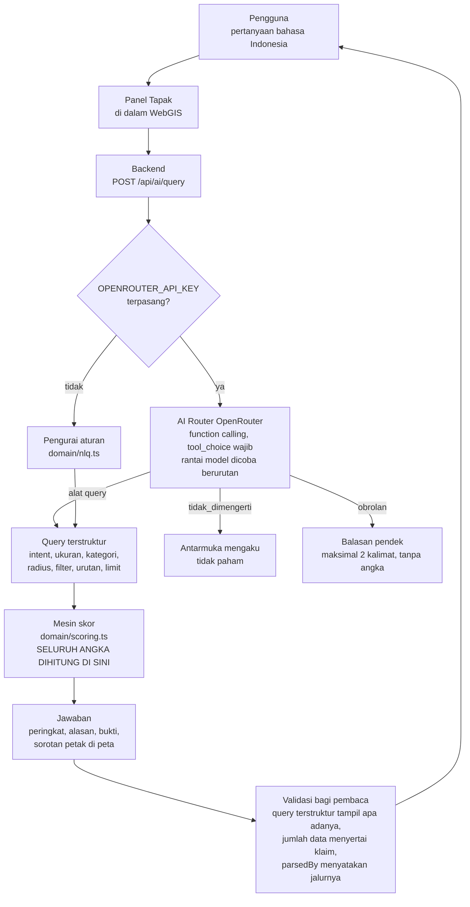
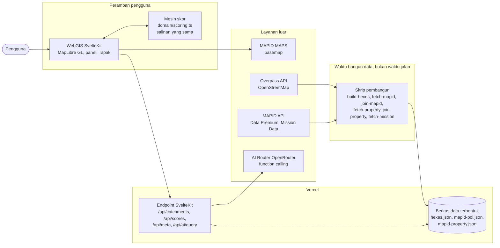

# PRODUCT REQUIREMENT DOCUMENT (PRD)

**MAPID WebGIS Competition #2 - 2026**
*Maps That Think! - Mass Transportation Edition*
WebGIS - Spatial Intelligence untuk Transportasi Massal

> Disusun mengikuti *Template PRD MAPID WebGIS Competition 2026*. Urutan dan judul bagian
> mengikuti template. Seluruh angka di dokumen ini dibaca dari data yang ada di repositori
> (`src/lib/data/hexes.json` beserta blok `meta` yang ditulis oleh skrip pembangun data),
> bukan diketik tangan. Membangun ulang datanya membuat setiap angka di sini ikut berubah.

---

## Halaman Judul

| | |
|---|---|
| **Nama Tim** | Triple T |
| **Judul Proyek** | SpotOn, WebGIS *site-selection* untuk usaha ritel dan F&B di catchment transit Jakarta |
| **Institusi** | Universitas Bina Nusantara |
| **Ketua Tim** | Valent Nathanael |
| **Kontak** | *[isi email dan nomor WhatsApp ketua tim sebelum dikumpulkan]* |

**Anggota Tim**

| No. | Nama Lengkap | Peran dalam Tim |
|---|---|---|
| 1 | Valent Nathanael | Project Leader, pengembangan WebGIS dan mesin skor |
| 2 | Farhan Aulianda | *[konfirmasi peran]* |
| 3 | Anthony Gilles Rudolfo | *[konfirmasi peran]* |

*Catatan: peran anggota 2 dan 3 perlu dikonfirmasi tim sebelum dikumpulkan. Dokumen ini
tidak mengarang isian yang hanya tim yang tahu.*

*Nama berkas saat dikumpulkan: `TripleT_SpotOn.pdf`, A4, font minimal 11 pt.*

---

## 1. Ringkasan Eksekutif

**Ide WebGIS.** SpotOn adalah WebGIS *site-selection* yang menjawab satu pertanyaan yang
sangat sering ditanyakan dan hampir tidak pernah terjawab dengan data: usaha apa yang masuk
akal dibuka di sekitar sini, dan kenapa. Untuk setiap petak dalam jangkauan jalan kaki dari
simpul transit Jakarta, SpotOn membaca tiga sinyal yang selama ini terpisah, yaitu permintaan,
persaingan, dan ketersediaan ruang usaha, lalu menghitung **Skor Peluang** per jenis usaha dan
menjelaskan alasannya dalam bahasa manusia.

**Masalah utama.** Calon pemilik warung, kedai, atau laundry memilih lokasi dengan cara
berjalan di satu ruas jalan, melihat ramai, lalu menandatangani kontrak. Tiga hal yang
sebenarnya menentukan usaha itu bertahan atau tidak semuanya bisa diketahui, tetapi tersebar
di tempat berbeda dan tidak pernah dibaca bersama pada resolusi jalan kaki.

**Dataset.** Katalog Data Premium MAPID sebagai sumber utama, yaitu **24.630 titik pesaing**
dari 55 dataset untuk 13 kategori usaha, dan **3.547 listing properti komersial**. Ditambah
data pendukung terbuka dari OpenStreetMap melalui Overpass API, yaitu **1.105 simpul transit**
empat moda dan **5.711 POI pesaing**, sesuai ketentuan data pendukung pada aturan panitia.

**Rencana Survey Activities.** Survei lapangan lewat MAPID APPS diarahkan oleh antrian
prioritas yang sudah dihasilkan produk sendiri, yaitu **100 petak yang belum tercakup katalog
MAPID** dan **178 petak yang tercakup tetapi harga ruangnya belum terbaca**. Survei mengisi
justru lubang yang produk ini menolak menambalnya dengan angka karangan.

**Analisis spasial.** *Spatial join* titik pesaing dan listing properti ke kisi heksagon H3
resolusi 8 pada lima radius jalan kaki, penghitungan indeks akses transit berbobot moda, lalu
*scoring* dan *indexing* peluang per kategori usaha.

**Peran AI.** Model bahasa lewat OpenRouter dengan *function calling* menerjemahkan pertanyaan
bebas berbahasa Indonesia menjadi **query terstruktur**. Model hanya memilih operasi dan
mengisi argumen. **Seluruh angka dihitung mesin skor dari data**, dan query terstrukturnya
ditampilkan apa adanya supaya jawabannya bisa diperiksa.

**Hasil utama.** Daftar pendek petak berperingkat per jenis usaha, lengkap dengan alasan satu
kalimat, rincian skor tahap demi tahap, jumlah data di belakang setiap klaim, dan penandaan
jujur untuk wilayah yang memang belum terdata.

---

## 2. Tujuan Produk

### Problem Statement

**1. Kondisi atau masalah saat ini.** Pemilihan lokasi usaha kecil di Jakarta dilakukan dengan
pengamatan sesaat. Tiga penentu kelayakan lokasi masing-masing terpisah, yaitu berapa banyak
orang yang benar benar lewat, berapa banyak pesaing sejenis yang sudah ada, dan apakah ada
ruang usaha yang bisa ditempati dengan harga yang sanggup dipikul. Tidak ada alat publik yang
membaca ketiganya bersama pada resolusi jalan kaki.

**2. Pihak yang terdampak.** Pemilik dan calon pemilik usaha mikro dan kecil, terutama yang
baru pertama kali membuka usaha dan modalnya terbatas. Ikut terdampak pemilik atau agen
properti yang unitnya menganggur di lokasi yang sebenarnya kurang terlayani, serta tim
ekspansi ritel dan waralaba.

**3. Dampak dari masalah.** Modal yang tidak besar habis di lokasi yang sudah jenuh, atau di
lokasi yang ramai tetapi ramai untuk jenis usaha yang lain. Kerugiannya ditanggung sendiri,
sering kali beserta sisa kontrak sewa yang tetap harus dibayar.

**4. Kenapa penting diselesaikan dengan WebGIS.** Pertanyaan ini tidak punya bentuk selain
bentuk spasial. Permintaan, persaingan, dan ketersediaan ruang semuanya adalah sifat sebuah
area yang bisa dijalani kaki, dan ketiganya berubah dalam jarak beberapa ratus meter. Tabel
tidak bisa menyatakan bahwa satu petak dilayani MRT sekaligus dua koridor TransJakarta
sementara petak di sebelahnya tidak dilayani apa pun. Jaringan transit massal justru yang
membuat soal ini bisa dikerjakan, karena transit menaruh aliran orang yang berulang dan bisa
diperkirakan pada sekumpulan tempat yang diketahui.

### Tujuan

**1. Tujuan utama produk.** Memberi calon pemilik usaha daftar pendek lokasi berperingkat per
jenis usaha di sekitar jaringan transit Jakarta, beserta alasan yang bisa mereka ulangi
sendiri.

**2. Hasil yang ingin diberikan kepada pengguna.** Bukan peta yang harus ditafsirkan, melainkan
jawaban yang bisa ditindaklanjuti. Setiap angka bisa dibuka sampai ke titik sumbernya di dalam
antarmuka, dan setiap klaim membawa jumlah data di belakangnya.

**3. Dampak yang diharapkan.** Keputusan lokasi yang diambil dengan bukti, bukan tebakan.
Modal usaha kecil yang lebih jarang habis di lokasi yang sebetulnya sudah bisa dibaca jenuh
sejak awal, dan ruang komersial menganggur yang lebih cepat bertemu penyewa yang cocok.

### Value Proposition

**1. Pengguna utama dan masalahnya.** Pemilik usaha mikro dan kecil yang tidak melek GIS,
belum pernah membaca peta koroplet, dan sedang menimbang satu keputusan besar dengan modal
terbatas.

**2. Cara produk membantu.** Produk bertanya lebih dulu, bukan menunggu ditanya. Tapak, tokoh
pemandu di dalam antarmuka, menyapa, menanyakan usaha apa yang sedang dipikirkan, dan
menawarkan jawaban yang tinggal disentuh. Pengaturan lanjutan disembunyikan, tetapi angka
lengkapnya selalu satu ketukan jauhnya.

**3. Manfaat bagi pengguna.** Daftar pendek yang bisa langsung didatangi, alasan yang bisa
disampaikan ke pasangan atau pemberi pinjaman, dan gambaran harga ruang di sekitarnya.

**4. Keunggulan solusi dan nilai tambah.**

| Unsur | Nilai tambah yang spesifik |
|---|---|
| WebGIS | Unit analisisnya heksagon H3 resolusi 8, bukan catchment per halte. Halte TransJakarta berjarak 400 sampai 500 m sedangkan jangkauan jalan kaki 800 m, sehingga catchment per halte akan bertumpuk dan menghitung pembeli yang sama berulang kali. Pada kisi, tiap petak dihitung sekali dan akses transit menjadi sifat petak, sehingga lokasi yang dilayani MRT sekaligus TransJakarta memang unggul |
| Survey Activities | Survei tidak diarahkan ke tempat yang paling mudah, melainkan ke antrian prioritas yang dihasilkan produk sendiri, yaitu petak yang datanya kosong dan harganya belum terbaca |
| Analisis spasial | Ketersediaan ruang usaha diperlakukan sebagai **gerbang**, bukan bonus. Peluang yang tidak bisa ditempati bukan peluang |
| AI | Model hanya memilih operasi dan mengisi argumen. Tidak satu angka pun berasal dari model, dan query terstrukturnya ditampilkan apa adanya untuk diperiksa |
| Kejujuran data | Petak yang belum disurvei ditulis belum terdata, tidak pernah dibaca sebagai nol pesaing. Kalau data kosong dibaca nol, wilayah yang paling sedikit diperiksa justru akan dinobatkan sebagai peluang terbaik |

---

## 3. Ruang Lingkup Produk

### In-Scope

- **Fitur utama.** Peta interaktif satu layar penuh, penyaring 13 kategori usaha, bobot
  permintaan dan persaingan yang bisa digeser, radius jalan kaki 400 sampai 800 m, gerbang
  ketersediaan ruang, pemilih sumber pesaing, panel rincian petak, tabel atribut petak dan
  unit properti, serta panel percakapan AI.
- **Dataset.** Katalog Data Premium MAPID untuk pesaing dan properti komersial, ditambah data
  pendukung terbuka OpenStreetMap untuk simpul transit, geometri jalur, dan POI pesaing.
- **Analisis spasial.** Pembangunan kisi H3 resolusi 8, *spatial join* titik ke petak pada
  lima radius, indeks akses transit berbobot moda, dan *scoring* peluang per kategori.
- **Visualisasi WebGIS.** Koroplet Skor Peluang, titik pesaing, titik unit properti, jalur dan
  simpul empat moda transit, legenda skor yang selalu tampak, dan penandaan petak belum
  terdata.
- **Dashboard dan insight.** Rincian skor tahap demi tahap, batang peluang lintas kategori,
  rincian moda transit yang dijangkau petak, ringkasan pesaing, dan ringkasan harga ruang.
- **Peran AI.** Pemahaman pertanyaan bahasa Indonesia menjadi query terstruktur lewat
  *function calling*, penyusunan ringkasan, perbandingan antarpetak, penandaan kejenuhan, dan
  laporan cakupan data.
- **Output utama untuk pengguna.** Daftar pendek petak berperingkat per jenis usaha, dengan
  alasan, bukti angka, dan jumlah data di belakangnya.
- **Dwibahasa dan aksesibilitas.** Seluruh teks tersedia dalam Bahasa Indonesia dan Inggris,
  tema terang dan gelap, serta penghormatan penuh pada `prefers-reduced-motion`,
  `prefers-reduced-transparency`, dan `prefers-contrast`.

### Out-of-Scope

- **Peramalan omzet atau jumlah pengunjung.** Mesin melaporkan selisih peluang, bukan proyeksi
  pendapatan. Angka rupiah yang bukan harga penawaran teramati akan menjadi angka karangan.
- **Pasar properti.** SpotOn menampilkan apa yang dipasarkan di sekitar petak, tetapi tidak
  memperantarai, menghubungi penjual, atau menyimpan stok unit.
- **Harga sewa.** Katalog tidak menerbitkan satu pun listing sewa untuk Jakarta, sehingga
  produk tidak akan menampilkan harga sewa. Lihat bagian 4.
- **Wilayah di luar Jabodetabek**, dan wilayah yang tidak terjangkau 800 m dari simpul transit.
- **Akun pengguna, penyimpanan daftar pendek, dan fitur kolaborasi.**
- **Aplikasi selain WebGIS.** Tidak ada aplikasi seluler *native*.
- **Klasifikasi visual dari foto** sebelum data survei tersedia. Fitur ini bergantung pada
  kolom foto hasil Survey Activities, jadi dijadwalkan setelah survei berjalan.

---

## 4. User Persona

### Persona 1 - Calon pemilik usaha mikro, pengguna utama

- **Nama:** Bu Rina
- **Jabatan:** Calon pemilik warung makan, saat ini karyawan yang akan resign
- **Usia:** 38 tahun
- **Latar Belakang:** Tinggal di Jakarta Timur. Modal berasal dari pesangon dan tabungan,
  jumlahnya terbatas dan tidak bisa diulang. Memakai ponsel Android kelas menengah dengan
  kuota data. Belum pernah memakai perangkat GIS dan belum pernah membaca peta koroplet.
- **Goals:** Menemukan dua atau tiga lokasi yang masuk akal untuk didatangi langsung minggu
  ini, dan tahu kira kira ruang usaha di sana dijual berapa per meter persegi.
- **Pain Points:** Semua ruas jalan terlihat ramai pada jam tertentu. Tidak tahu berapa
  pesaing sejenis yang sudah ada di radius jalan kaki. Takut menandatangani kontrak di lokasi
  yang ternyata sudah jenuh.
- **Needs:** Jawaban dalam bahasa sehari hari, alasan yang bisa diulang ke suami dan ke
  pemberi pinjaman, serta kejelasan bahwa angkanya berasal dari hitungan, bukan tebakan.
- **User Stories:**
  - Sebagai calon pemilik warung, saya ingin bertanya "di dekat stasiun mana warung makan
    masih kurang" dan mendapat daftar pendek, supaya saya tidak perlu belajar peta.
  - Sebagai pengguna yang tidak melek GIS, saya ingin melihat alasan satu kalimat pada setiap
    lokasi yang direkomendasikan, supaya saya bisa menilai sendiri masuk akal atau tidak.
  - Sebagai pemilik modal terbatas, saya ingin tahu berapa banyak pesaing yang dihitung dan
    dari survei mana angkanya, supaya saya tahu seberapa tebal dasarnya.

### Persona 2 - Tim ekspansi ritel

- **Nama:** Bapak Adi
- **Jabatan:** Manajer Ekspansi, jaringan minimarket dan kedai kopi
- **Usia:** 41 tahun
- **Latar Belakang:** Bertanggung jawab atas rencana pembukaan gerai tahunan. Terbiasa membaca
  data, memakai laptop, dan sudah punya kriteria internal. Membutuhkan pembanding eksternal
  yang metodenya bisa diaudit.
- **Goals:** Menyaring koridor transit menjadi daftar petak prioritas per kategori, dan
  menandai wilayah yang sudah jenuh supaya tidak dimasukkan ke rencana.
- **Pain Points:** Data pesaing dari sumber berbeda tidak bisa dibandingkan langsung. Survei
  lapangan mahal, jadi harus diarahkan ke tempat yang paling perlu.
- **Needs:** Perbandingan antarpetak, penandaan kejenuhan, kemampuan mengganti sumber pesaing
  dan melihat pengaruhnya, serta laporan cakupan data yang jujur.
- **User Stories:**
  - Sebagai manajer ekspansi, saya ingin membandingkan dua catchment secara langsung, supaya
    saya bisa memilih di antara keduanya.
  - Sebagai perencana survei, saya ingin melihat petak mana yang belum terdata, supaya anggaran
    survei diarahkan ke sana.
  - Sebagai pembaca data, saya ingin mengganti sumber pesaing antara OSM dan MAPID dan melihat
    skornya berubah, supaya saya tahu seberapa besar sumber memengaruhi kesimpulan.

---

## 5. Dataset Dasar

Sumber utama adalah data MAPID. Data OpenStreetMap dipakai sebagai data pendukung yang resmi,
terbuka, relevan, dan disebutkan sumbernya, sesuai ketentuan data pendukung pada aturan
panitia.

| Dataset | Sumber | Fungsi dalam Produk |
|---|---|---|
| Katalog pesaing Data Premium, **24.630 titik**, 55 dataset, 13 kategori usaha | MAPID Data Premium melalui `geoserver.mapid.io` | Sisi persaingan pada Skor Peluang, dan sisi permintaan setelah kategori yang ditanyakan dikurangkan. Tercakup pada **462 dari 562 petak**, yaitu lima kota administrasi DKI Jakarta |
| Katalog properti komersial, **3.547 listing** | MAPID Data Premium melalui `geoserver.mapid.io` | Gerbang ketersediaan ruang usaha dan faktor biaya ruang. Digabungkan pada lima radius jalan kaki. **462 petak** tercakup, **284 petak** punya harga yang terbaca |
| Basemap MAPID MAPS | MAPID Map Service | Basemap utama WebGIS, sesuai ketentuan wajib panitia |
| Mission Data Struk Go, Menu Go, Properti Go | MAPID, dibuka untuk 50 tim terkurasi | Direncanakan untuk profil transaksi per jam, tingkat keramaian pesaing, dan listing ruang per kategori. Lihat catatan di bawah |
| Community Maps Activity | MAPID APPS | Direncanakan sebagai lapisan aktivitas dan sebagai wadah hasil Survey Activities tim |
| Simpul transit empat moda, **1.105 simpul**, yaitu MRT 20, KRL 76, LRT 33, TransJakarta 976, beserta geometri jalur | OpenStreetMap melalui Overpass API, lisensi ODbL | Pembentukan kisi, penghitungan indeks akses transit per petak, dan lapisan jaringan pada peta |
| POI pesaing, **5.711 titik** untuk 9 kategori yang bisa ditandai OSM | OpenStreetMap melalui Overpass API, lisensi ODbL | Sumber pesaing kedua yang bisa dipilih pengguna, sekaligus penutup lubang pada 100 petak yang belum tercakup katalog MAPID |
| Batas administrasi kota, `admin_level=5` | OpenStreetMap | Penentu cakupan per kota, dipakai untuk memutuskan petak mana yang boleh diberi skor |

**Catatan penting mengenai Mission Data.** Ketiga dataset misi belum terjangkau sampai hari
ini, baik di katalog premium maupun di indeks lapisan publik. Hal ini sudah diuji melalui
setiap rute yang bisa dicapai kunci API, dan pengujian itu diulang setiap kali
`scripts/fetch-mission.mjs` dijalankan tanpa argumen. Tanggapan tim atas keadaan itu adalah
**menghapus kolom karangan, bukan menyimpannya sebagai contoh**. Profil 24 jam, jumlah struk,
jumlah menu, pangsa nontunai, pangsa keramaian per kategori, dan listing sewa per kategori
sudah dihapus seluruhnya dari bentuk data. Pembacanya sudah ditulis dan diuji tanpa jaringan,
dan tiga variabel lingkungan menyalakannya begitu id lapisannya ada.

**Catatan penting mengenai data properti.** Katalog menerbitkan **harga penawaran jual**, dan
tidak satu pun listing sewa untuk DKI Jakarta. Ini bukan asumsi, melainkan hasil pengukuran:
`scripts/fetch-property.mjs` menghitung ulang kolom jual atau sewa pada seluruh dataset
properti provinsi setiap kali dijalankan, dan hasilnya 3.547 baris bernilai `JUAL`. Produk
mengikuti hasil pengukuran itu, jadi kolomnya bernama harga dan bukan sewa, dan antarmuka
menyebutnya harga jual yang diminta. Median di seluruh kisi pada radius 800 m adalah
**Rp 45.000.000 per m²**. Satu petak baru diberi harga bila ada minimal **3 unit berharga**
dalam jangkauan, karena dua unit terlalu tipis untuk dibaca mediannya.

---

## 6. Rencana Survey Activities

### Lokasi

- **Wilayah pelaksanaan.** Koridor transit di Jabodetabek, dibatasi pada petak yang sudah ada
  di kisi produk, yaitu area dalam radius 800 m dari simpul MRT, KRL, LRT, atau TransJakarta.
- **Batas dan cakupan.** Survei diarahkan oleh antrian prioritas yang dihasilkan produk
  sendiri, dengan dua kelompok sasaran:
  1. **100 petak yang belum tercakup katalog MAPID**, yaitu Depok 20 petak, Bekasi 21,
     Tangerang 17, Tangerang Selatan 15, Kabupaten Bekasi 5, Kabupaten Tangerang 2, dan 20
     petak yang berada di luar batas administrasi mana pun.
  2. **178 petak yang tercakup tetapi harga ruangnya belum terbaca**, yaitu selisih 462 petak
     tercakup properti dengan 284 petak yang sudah punya median harga.
- Urutan pengerjaan di dalam dua kelompok itu memakai peringkat permintaan, sehingga petak
  yang tradenya paling tebal disurvei lebih dahulu.

### Objek

- **Objek yang disurvei.** Gerai pesaing untuk 13 kategori usaha yang diskor, unit ruang usaha
  yang sedang dipasarkan, dan simpul transit beserta akses pejalan kaki menuju petak.
- **Informasi yang dikumpulkan tiap objek.** Nama dan kategori usaha, keberadaannya pada
  koordinat yang tercatat, kondisi bangunan dan muka toko, jam buka, indikasi keramaian saat
  kunjungan, dan untuk unit properti, luas, jenis, serta harga yang dipasang bila tercantum.

### Output

Atribut yang dihasilkan survei, mengikuti daftar pada template:

- Nama objek atau tempat
- Kategori objek, dipetakan ke 13 kategori usaha produk
- Tanggal dan waktu survei
- Alamat
- Foto dokumentasi
- Kondisi objek
- Catatan survei
- Latitude
- Longitude
- Informasi tambahan, yaitu jam buka, perkiraan keramaian, dan status unit dipasarkan

### Ketentuan Survey yang dipatuhi

- Data harus sesuai kondisi lapangan.
- Koordinat harus sesuai lokasi objek.
- Foto harus jelas dan tidak buram.
- Foto tidak menampilkan wajah seseorang secara jelas maupun plat nomor kendaraan.
- Data tidak berasal dari sumber manipulasi seperti Google Street View atau internet.
- Data hasil survei divalidasi sebelum dipakai, dengan pemeriksaan silang terhadap hitungan
  katalog pada petak yang sama.

### Pemanfaatan Hasil Survey

| Pemanfaatan | Wujudnya di dalam SpotOn |
|---|---|
| Melengkapi dataset dasar | 100 petak yang hari ini bertanda belum terdata memperoleh hitungan pesaing yang sah, sehingga bisa diberi skor |
| Memvalidasi kondisi lapangan | Hitungan katalog pada petak yang disurvei dibandingkan dengan hitungan lapangan, dan selisihnya dilaporkan apa adanya, bukan dirata rata diam diam |
| Menambahkan titik data pada peta | Titik hasil survei tampil sebagai lapisan tersendiri dan bisa dibandingkan dengan lapisan katalog |
| Menjadi input analisis spasial | Hitungan hasil survei masuk sebagai sumber pesaing ketiga yang bisa dipilih, dan harga yang tercatat menambah petak berharga di luar 284 yang ada |
| Menjadi dasar insight atau rekomendasi AI | Foto kondisi muka toko membuka klasifikasi visual, yaitu tingkat formalitas dan kualitas muka toko, yang menjadi indikator baru untuk dibaca AI dan ditampilkan sebagai atribut petak |

---

## 7. Metode Pengolahan Data, AI, dan Analisis Spasial

### Data Processing

**Cleaning.** Simpul transit dari Overpass dinormalkan lalu dideduplikasi menjadi 1.105 simpul
dari empat moda. Nama halte dan stasiun dirapikan agar satu simpul tidak terhitung dua kali
karena beda penulisan. Kategori usaha dari katalog MAPID dipetakan ke 13 kategori produk, dan
pemetaan itu ditulis eksplisit pada `domain/categories.ts` supaya bisa diperiksa.

**Validasi.** Aturan pokoknya adalah **kosong bukan nol**. Petak yang kotanya tidak pernah
disurvei sumber aktif mengembalikan skor `null` dan tipologi belum terdata, tidak pernah
diberi angka. Kategori yang tidak punya tag OSM, yaitu warteg, mie, seafood, dan restoran
asing, dibaca sebagai belum terdata pada sumber OSM, bukan nol pesaing. Bila satu kategori
dalam satu pertanyaan gabungan belum terdata, seluruh gabungannya dinyatakan belum terdata,
karena penjumlahan yang diam diam melewati bagian yang hilang adalah kebohongan yang sama pada
tingkat himpunan. Lima berkas uji mandiri dijalankan lewat `npm run selftest` untuk komposisi
skor, hitungan POI, gabungan properti, penguraian pertanyaan, dan unit properti.

**Integrasi.** Dua survei tidak pernah dijumlahkan. Katalog MAPID mencatat 2.351 kedai kopi dan OSM
mencatat 1.170, dan 1.170 itu sebagian besar kedai yang sama tanpa id bersama untuk
dicocokkan. Menjumlahkannya akan melaporkan satu ruas dengan delapan kedai kopi sebagai empat
belas. Kerapatan keduanya juga jauh berbeda, misalnya OSM mencatat 65 kedai minuman untuk
seluruh Jakarta sedangkan MAPID mencatat 858, sehingga jumlah pesaing tidak boleh
dibandingkan lintas sumber. Sumber `both` membaca tiap petak dari survei yang benar benar
menjangkaunya, dan bila keduanya menjangkau, dari yang menemukan lebih banyak. Hasilnya adalah
lantai, bukan tebakan, yaitu sekurang kurangnya sebanyak ini, karena ada yang menghitungnya.

### Spatial Analysis

**1. Metode analisis spasial yang digunakan.** Pembangunan kisi heksagon H3 resolusi 8,
*spatial join* titik ke petak pada lima radius jalan kaki, pembangunan indeks akses transit
berbobot moda dengan peredaman akar, *ranking* harga ruang di seluruh kisi, serta *scoring*
dan *indexing* peluang per kategori usaha.

**2. Data yang digunakan.** Simpul transit dan POI pesaing OSM, titik pesaing katalog MAPID,
listing properti komersial MAPID, dan batas administrasi kota.

**3. Tujuan analisis.** Mengukur selisih antara permintaan dan persaingan pada satu petak untuk
satu jenis usaha, lalu menyesuaikannya dengan akses transit, ketersediaan ruang, dan harga
ruang.

**4. Output yang dihasilkan.** Skor Peluang 0 sampai 1 per petak per kategori, tipologi petak,
peringkat, serta rincian tahap demi tahap yang bisa dibaca pengguna.

**Rumus Skor Peluang**

```
Gap   = (wd · permintaan − ws · persaingan) / (wd + ws)
Skor  = clamp01(Gap + 0.5) × gerbang_ruang × akses_transit × biaya_ruang
```

| Suku | Dihitung dari | Konstanta |
|---|---|---|
| permintaan | Seluruh usaha terhitung dalam jangkauan **dikurangi** kategori yang ditanyakan, dinormalkan terhadap petak tersibuk. Pengurangan itu intinya. Bila dibiarkan utuh, ruas yang penuh minimarket akan memberi tahu calon pemilik minimarket bahwa permintaannya tinggi | - |
| persaingan | Pesaing pada kategori yang ditanyakan, dinormalkan terhadap petak terpadat | - |
| gerbang_ruang | 1 bila ada ruang dipasarkan dalam jangkauan. **0,15** bila gerbang menyala dan tidak ada apa apa di pasar, yaitu didorong ke dasar peringkat dan bukan dicoret, karena toko sebelah bisa saja kosong bulan depan | `GATE_BLOCKED = 0,15` |
| akses_transit | Hitungan simpul berbobot moda, diredam akar | Bobot moda MRT 1,0, KRL 0,9, LRT 0,6, TransJakarta 0,45. Pembagi 3,2. Pengali berjalan dari 0,6 sampai 1,0 |
| biaya_ruang | Median harga penawaran per m² dalam jangkauan, diperingkat di seluruh kisi. Masuk paling akhir sebagai pengali paling besar 1, sehingga biaya bisa mewarnai peringkat tanpa menentukannya | `COST_FLOOR = 0,75`. Bernilai 1 bila petak tidak berharga |

Titik seimbangnya 0,5, yaitu permintaan dan persaingan saling meniadakan. Skor adalah
simpangan dari titik itu, ke dua arah. Bobot bawaan adalah `wd` 0,5, `ws` 0,5, gerbang menyala,
radius 800 m, sumber `both`.

### AI Integration

**1. Input AI.** Pertanyaan bebas berbahasa Indonesia dari pengguna, ditambah kategori dan
bobot yang sedang berlaku pada antarmuka. Bukan data mentah, melainkan pertanyaan tentang
hasil analisis.

**2. Proses integrasi.** Permintaan dikirim dari panel Tapak ke backend `POST /api/ai/query`.
Backend memanggil AI Router **OpenRouter** dengan *function calling* dan `tool_choice`
berstatus wajib. Model diberi tiga alat, yaitu alat query, alat percakapan ringan, dan alat
`tidak_dimengerti`. Model harus memanggil salah satunya. Rantai model dicoba berurutan, karena
model gratis sering sibuk. Keluaran model adalah **query terstruktur**, yaitu intent, ukuran,
kategori, radius, filter, pivot, urutan, dan limit. **Mesin skor kemudian menghitung setiap
angka dari data.**

**3. Output AI yang ditampilkan.** Judul jawaban, daftar rekomendasi berperingkat beserta
alasan dan buktinya, id petak yang disorot di peta, dan query terstruktur yang ditampilkan apa
adanya. Jawaban AI **mengubah peta**, yaitu sorotan berpindah dan peringkat mengikuti, jadi
keluarannya spasial dan bukan sekadar teks.

**Intent yang didukung:** `RANK` untuk memeringkat petak menurut ukuran mana pun yang
terdaftar, `COMPARE` untuk membandingkan petak yang disebut namanya, `FLAG_SATURATED` untuk
menandai kategori yang sudah jenuh, dan `COVERAGE` untuk melaporkan apa yang sudah dan belum
tersurvei.

**Validasi keluaran AI.** Query terstruktur tampil apa adanya di sebelah jawaban. Setiap klaim
membawa jumlah data di belakangnya. Kolom `parsedBy` menyatakan apakah model atau pengurai
aturan yang menghasilkannya, sehingga jalur yang ditempuh tidak pernah disamarkan. Tanpa kunci
API, pengurai aturan mengambil alih dan aplikasi tetap berjalan. Filter hanya boleh menyebut
ukuran dan pita rendah, tinggi, atau ada, dengan pita dihitung dari data saat query berjalan.
Tidak ada cara menyatakan di bawah 30 juta, karena ambang yang dipasok lapisan pemahaman akan
menjadi satu satunya angka dalam jawaban yang tidak berasal dari data siapa pun.

**Bagan alur AI**



### Output

- **Ringkasan hasil analisis.** Skor Peluang per petak per kategori, tipologi petak, dan
  rincian tahap demi tahap yang menunjukkan bagaimana skor itu terbentuk.
- **Insight atau rekomendasi.** Daftar pendek berperingkat dengan alasan satu kalimat, penanda
  kejenuhan, perbandingan antarpetak, dan laporan cakupan data.
- **Prioritas tindakan atau pengembangan.** Antrian survei berisi petak yang belum terdata dan
  petak yang harganya belum terbaca, diurutkan menurut ketebalan permintaan.

---

## 8. Fitur Produk dan Acceptance Criteria

| Fitur Produk | Acceptance Criteria |
|---|---|
| **Peta interaktif satu layar penuh** dengan basemap MAPID MAPS, panel mengambang di atasnya | Peta menjadi elemen utama halaman. Zoom, geser, dan cubit berfungsi di desktop dan seluler. Basemap yang termuat adalah MAPID MAPS |
| **Koroplet Skor Peluang** per petak untuk kategori terpilih | Warna petak berubah seketika saat kategori diganti. Legenda skor selalu tampak. Petak belum terdata memakai penanda tersendiri, bukan warna skor terendah |
| **Penyaring 13 kategori usaha**, termasuk beberapa kategori sekaligus | Memilih satu kategori atau beberapa kategori menghasilkan peringkat yang berbeda dan konsisten. Kategori yang tidak punya sumber pada sumber aktif dinyatakan belum terdata |
| **Kontrol bobot dan gerbang**, yaitu `wd`, `ws`, radius 400 sampai 800 m, gerbang ruang, dan sumber pesaing | Menggeser bobot menghitung ulang skor di klien tanpa memuat ulang halaman, dan hasilnya identik dengan hasil endpoint server untuk parameter yang sama |
| **Klik petak membuka panel rincian** | Panel menampilkan nama, skor, permintaan, persaingan, jumlah pesaing, simpul transit yang dijangkau beserta modanya, unit properti dipasarkan, dan median harga per m² |
| **Rincian skor tahap demi tahap** | Pembaca dapat melihat setiap suku rumus beserta nilainya, dan hasil akhirnya sama dengan skor yang tampil di peta |
| **Tabel atribut petak dan unit properti**, bisa diurutkan per kolom | Mengeklik kepala kolom mengurutkan tabel. Mengeklik baris menyorot petak atau unit yang bersangkutan di peta |
| **Lapisan jaringan transit empat moda** | Simpul dan jalur MRT, KRL, LRT, dan TransJakarta dapat ditampilkan dan disembunyikan |
| **Panel percakapan AI Tapak** | Tapak menyapa lebih dahulu, mengajukan pertanyaan penjelas, dan menawarkan jawaban yang tinggal disentuh. Tapak berkomentar saat pengguna memilih petak sendiri |
| **Pemahaman pertanyaan bahasa Indonesia** | Pertanyaan bebas menghasilkan jawaban yang benar untuk keempat intent. Query terstrukturnya ditampilkan apa adanya. Kolom `parsedBy` tampil pada setiap jawaban |
| **Penolakan yang jujur** | Pertanyaan di luar jangkauan data memicu `tidak_dimengerti` dan antarmuka mengakuinya. Pertanyaan yang butuh jenis usaha tetapi belum menyebutnya menampilkan tawaran kategori, bukan permintaan maaf |
| **Jawaban AI mengubah peta** | Setiap jawaban memindahkan sorotan dan mengubah peringkat, bukan hanya menulis teks |
| **Panel provenans** | Setiap kelompok data menyebutkan sumber, jumlah titik, dan cakupannya. Pernyataan bahwa harga properti adalah harga jual dan bukan sewa selalu tampil |
| **Antrian prioritas survei** | Produk dapat menampilkan daftar petak belum terdata dan petak tanpa harga, terurut menurut permintaan |
| **Dwibahasa** | Setiap teks yang terlihat pengguna tersedia dalam Bahasa Indonesia dan Inggris, dan pengalih bahasa mengubah seluruh halaman |
| **Aksesibilitas dan responsif** | Produk tetap sepenuhnya dapat dipakai dengan gerak dimatikan. `prefers-reduced-motion`, `prefers-reduced-transparency`, dan `prefers-contrast` dihormati. Peta nyaman dipakai pada layar ponsel kelas menengah |
| **Halaman muka yang menjelaskan masalah** | Halaman `/` menjelaskan masalah, metode, dan ringkasan insight bagi pembaca yang belum pernah melihat WebGIS, dengan maket isometrik yang digerakkan gulir |

---

## 9. Persyaratan Teknis

| Lapisan | Teknologi |
|---|---|
| **Frontend** | SvelteKit 2 dengan Svelte 5 *runes*, TypeScript, dan three.js untuk maket isometrik pada halaman muka |
| **Backend** | Endpoint server SvelteKit yang berjalan sebagai *serverless function* di Vercel. Mesin skor `domain/scoring.ts` dipakai server dan klien tanpa perbedaan, sehingga geseran slider dan panggilan API tidak mungkin berselisih |
| **Database** | Tidak memakai basis data server. Hasil pembangunan data disimpan sebagai berkas JSON terbentuk di dalam repositori, yaitu kisi, POI, dan properti, karena datanya statis antar pembangunan dan cara ini menekan waktu muat pada koneksi seluler. Sumber datanya tetap API MAPID dan Overpass, dibaca oleh skrip pembangun |
| **GIS** | MapLibre GL untuk peta, H3 resolusi 8 untuk unit spasial melalui `h3-js`, Overpass API untuk data OSM, dan MAPID MAPS sebagai basemap |
| **AI** | AI Router OpenRouter dengan *function calling*, disertai pengurai aturan sebagai cadangan penuh |
| **Deployment** | Vercel dengan `adapter-vercel` |

### Technology Architecture



---

## 10. User Flow / Wireframe

### User Flow

**1. Titik awal pengguna.** Halaman muka `/`. Maket isometrik satu blok jalan yang digerakkan
gulir, dengan jam pada hari itu menentukan cahaya, langit, dan kepadatan orang. Pembaca
melihat masalahnya sebelum melihat peta apa pun.

**2. Langkah atau tindakan utama.** Pengguna masuk ke `/app`. Tapak menyapa dan menanyakan
usaha apa yang sedang dipikirkan, dengan pilihan jawaban yang tinggal disentuh. Pengguna
menjawab, atau mengetik pertanyaan sendiri, atau memilih kategori dari deretan chip.

**3. Proses analisis.** Pertanyaan diterjemahkan menjadi query terstruktur. Mesin skor
menghitung Skor Peluang seluruh petak untuk kategori dan bobot yang berlaku, lalu memeringkat
dan menyorot.

**4. Hasil yang diterima pengguna.** Peta berganti warna, daftar pendek berperingkat muncul
dengan alasan satu kalimat per baris. Pengguna mengetuk satu petak dan memperoleh rincian
lengkap, yaitu skor beserta uraiannya, pesaing terhitung, simpul transit yang dijangkau, unit
yang dipasarkan, dan harga per m². Bila perlu, pengguna membuka Pengaturan lanjutan untuk
menggeser bobot, mengubah radius, atau mengganti sumber pesaing, dan skor dihitung ulang
seketika.

### Wireframe

Rancangan halaman utama, `/app`, pada layar lebar:

```
┌──────────────────────────────────────────────────────────────────────┐
│  SpotOn      [chip kategori: Kopi Minuman Roti Warteg ... ]   ID/EN ☾ │
├───────────────────────────────────────────────┬──────────────────────┤
│                                               │  TAPAK               │
│                                               │  "Mau buka usaha     │
│      PETA MAPID MAPS, SATU LAYAR PENUH        │   apa di sekitar     │
│      koroplet Skor Peluang per petak H3       │   mana?"             │
│      simpul dan jalur MRT KRL LRT TJ          │  [Kopi] [Warteg] ... │
│      petak belum terdata bertanda arsir       │                      │
│                                               │  ── jawaban ──       │
│   ┌───────────────────────┐                   │  1. Cikini      0,78 │
│   │ PANEL RINCIAN PETAK   │                   │     alasan ...       │
│   │ skor 0,78 diurai      │        [+][−]     │  2. Manggarai   0,74 │
│   │ pesaing 12, dari OSM  │                   │  3. Tebet       0,71 │
│   │ transit MRT 1, TJ 3   │   ┌────────────┐  │                      │
│   │ unit dipasarkan 4     │   │  LEGENDA   │  │  query terstruktur:  │
│   │ Rp 51 jt per m²       │   │  skor 0..1 │  │  {intent: RANK, ...} │
│   │ [buka tabel atribut]  │   └────────────┘  │  diurai oleh: model  │
│   └───────────────────────┘                   │                      │
├───────────────────────────────────────────────┴──────────────────────┤
│  ▸ Pengaturan lanjutan   wd ──●── ws   radius 800 m   gerbang ruang  │
│                          sumber pesaing: [OSM] [MAPID] [Keduanya]    │
└──────────────────────────────────────────────────────────────────────┘
```

Pada layar sempit, panel Tapak dan panel rincian menjadi satu lembar yang dapat ditarik
dengan tiga posisi berhenti, sehingga peta tetap terlihat sepanjang percakapan.

---

## 11. Timeline Development

Tahap M1 sampai M4 sudah berjalan dan hasilnya ada di repositori. Tahap M5 sampai M8 adalah
rencana, dan sebagian bergantung pada kurasi 50 tim serta pembukaan Mission Data.

| Minggu | Fokus Kegiatan | Target Output |
|---|---|---|
| **M1** | Penetapan masalah, kajian aturan panitia, dan pemilihan unit spasial | Keputusan memakai kisi H3 resolusi 8 dan bukan catchment per halte, beserta alasannya yang tercatat |
| **M2** | Pembangunan data transit dan kisi | 1.105 simpul transit empat moda, geometri jalur, dan 562 petak dengan indeks akses transit |
| **M3** | Mesin skor dan sumber pesaing OSM | `domain/scoring.ts`, 5.711 POI pesaing tergabung ke kisi, dan aturan kosong bukan nol yang diuji |
| **M4** | Integrasi katalog Data Premium MAPID dan data properti | 24.630 titik pesaing dari 55 dataset, 3.547 listing properti pada lima radius, dan pemilih sumber pesaing |
| **M5** | Antarmuka WebGIS dan lapisan AI | Panel Tapak, `POST /api/ai/query` dengan *function calling*, empat intent, dan pengurai aturan cadangan |
| **M6** | **Basemap MAPID MAPS, deployment, dan Survey Activities gelombang pertama** | Basemap wajib terpasang, WebGIS dapat diakses publik di Vercel, dan survei 100 petak yang belum tercakup |
| **M7** | Integrasi hasil survei dan Mission Data bila sudah terbuka | Hitungan hasil survei sebagai sumber pesaing ketiga, halaman Survey Activities, dan halaman Metodologi |
| **M8** | Klasifikasi visual dari foto survei, pengujian, dan penyempurnaan | Indikator kondisi muka toko sebagai atribut petak, pengujian pada perangkat kelas menengah, dan pemolesan akhir |

---

## 12. Risiko dan Mitigasi

| Risiko | Dampak | Mitigasi |
|---|---|---|
| **Mission Data tidak dibuka atau dibuka terlambat** | Sisi permintaan tetap dibaca dari trade sekitar, bukan dari struk. Analisis per jam tidak dapat dibuat | Pembaca dan pengurai kolomnya sudah ditulis dan diuji tanpa jaringan. Tiga variabel lingkungan menyalakannya dalam hitungan menit. Kolom karangan sudah dihapus, jadi produk tidak pernah bergantung padanya |
| **Basemap MAPID MAPS belum terpasang** | Komponen wajib panitia tidak terpenuhi | Cukup mengisi `PUBLIC_MAPID_STYLE_URL`, tanpa perubahan kode. Pemuat basemap sudah memeriksa nilainya dan memberi peringatan alih alih meninggalkan kanvas kosong. Dijadwalkan pada M6 |
| **100 petak di luar DKI tidak tercakup katalog MAPID** | Sumber `mapid` menampilkannya sebagai belum terdata | Perilaku ini benar dan bukan cacat. Sumber `both` membacanya dari OSM, dan keadaannya dinyatakan terbuka di antarmuka. Survey Activities menargetkan petak petak ini lebih dahulu |
| **Katalog properti tidak memuat harga sewa** | Biaya ruang terbaca sebagai biaya kepemilikan, bukan biaya bulanan | Diukur, bukan diasumsikan, dan diukur ulang setiap kali skrip berjalan. Penamaannya mengikuti, yaitu harga dan bukan sewa, dan antarmuka menyatakannya di setiap tempat harga muncul |
| **Model gratis pada AI Router sibuk atau lambat** | Jawaban melambat pada saat ramai | Rantai model dicoba berurutan, lalu pengurai aturan menjawab. Aplikasi tidak pernah gagal karena ini, dan kolom `parsedBy` menyatakan jalur mana yang dipakai |
| **Model mengarang angka** | Kepercayaan pada seluruh produk runtuh | Secara arsitektur tidak mungkin. Model hanya memilih alat dan mengisi argumen, dan seluruh angka dihitung mesin skor dari data. Filter pun hanya boleh menyebut pita, bukan ambang |
| **Data kosong terbaca sebagai nol pesaing** | Wilayah yang paling sedikit diperiksa akan dinobatkan sebagai peluang terbaik | Aturan kosong bukan nol ditegakkan di setiap tingkat, dari satu kategori sampai gabungan kategori, dan diuji oleh berkas uji mandiri |
| **Kinerja pada ponsel kelas menengah** | Pengguna utama justru yang paling dirugikan | Muatan dasar dan irisan per kategori dipisah dan disusun kolumnar. Maket isometrik hanya ada di halaman muka, dan seluruh gerak dapat dimatikan lewat `prefers-reduced-motion` |
| **Survei lapangan terkendala waktu atau biaya** | Cakupan tambahan lebih kecil dari rencana | Urutan survei sudah diprioritaskan oleh produk sendiri, sehingga survei sekecil apa pun tetap mengisi lubang yang paling bernilai lebih dahulu |

---

## 13. Rencana Deployment

| Komponen | Rencana |
|---|---|
| **Hosting** | Vercel, memakai `@sveltejs/adapter-vercel` yang sudah terpasang. Endpoint API berjalan sebagai *serverless function* pada wilayah terdekat. Basemap dilayani MAPID MAPS lewat `PUBLIC_MAPID_STYLE_URL`, dan kunci AI Router diisi sebagai *Environment Variable* sehingga penggantian model tidak memerlukan pembangunan ulang |
| **Database** | Tidak ada basis data server. Data hasil pembangunan disimpan sebagai berkas JSON terbentuk yang ikut ter-*deploy*, yaitu `hexes.json` untuk kisi dan atribut, `mapid-poi.json`, dan `mapid-property.json`. Sumber datanya API MAPID dan Overpass, dibaca ulang dengan menjalankan skrip pembangun lalu men-*deploy* ulang. Pilihan ini diambil demi waktu muat pada koneksi seluler |
| **Repository** | Git, dengan riwayat memakai Conventional Commits. Setiap perubahan melewati `npm run check`, `npm run build`, dan `npm run selftest` sebelum didorong. Data pribadi anggota tim sengaja tidak pernah dimasukkan ke repositori |

---

## 14. Lampiran

**Referensi dataset**

- Katalog Data Premium MAPID melalui `geoserver.mapid.io`. Daftar lengkap dataset yang dibaca
  ada pada `docs/mapid-layers.md`, yang ditulis oleh skrip dan bukan oleh tangan.
- Rincian cara pengambilan, endpoint yang sudah terverifikasi, dan cakupannya ada pada
  `docs/04-data-mapid.md` serta `docs/mapid-property.md`.
- OpenStreetMap melalui Overpass API, lisensi ODbL.

**Wireframe dan gambar**

- `docs/assets/fig1_peta.png` untuk peta, `fig2_ai.png` untuk panel AI, `fig3_detail.png` untuk
  panel rincian, dan `fig4_pipeline.png` untuk alur ujung ke ujung.
- `docs/assets/mockup-proposal.html` untuk maket satu berkas yang dibuat saat proposal.

**Flowchart**

- Bagan alur AI dan bagan arsitektur teknologi ada pada bagian 7 dan bagian 9 dokumen ini.

**Dokumentasi pendukung**

- `docs/00-ketentuan-kompetisi.md` untuk ketentuan panitia, yang menjadi sumber kebenaran bagi
  setiap keputusan produk.
- `docs/01-proposal-spoton.md` untuk proposal yang sudah dikumpulkan.
- `docs/03-status-implementasi.md` untuk pemetaan tiap komponen wajib ke bagian kode yang
  mengerjakannya.
- `docs/assets/Proposal_SpotOn.pdf` untuk versi PDF proposal.

**Dokumentasi survei**

Akan dilampirkan setelah Survey Activities gelombang pertama berjalan, berisi contoh titik
hasil survei beserta foto dokumentasi yang sudah memenuhi ketentuan panitia, yaitu jelas,
tidak buram, tanpa wajah yang terlihat jelas, dan tanpa plat nomor kendaraan.
